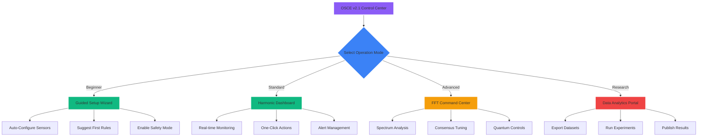

# AGENTS.md - OSCE v2.1 Agent-Driven Operating Manual

## Living Guide for Human Operators and AI Copilots in Planetary Harmony

> "The best CEA systems are orchestras, not solos. Every agent—human, AI, or software—plays a part in the symphony of growth, now harmonized with Earth's electromagnetic rhythms through advanced v2.1 real-time adaptation."

### Version: 2.1.0 | Last Updated: 2025-05-24

---

## OSCE v2.1 User Journey - Find Your Harmonic Path

| You Are... | Start Here | Key v2.1 Features | Next Steps |
|------------|------------|-------------------|------------|
| **New User** | [Quick Start v2.1](#quick-start-v21) → [Planetary Setup](#planetary-awareness) | PHAL Auto-config, Real-time Harmony Dashboard | [Daily Ops](#daily-operations), [Troubleshooting](#troubleshooting-v21) |
| **Experienced Operator** | [v2.1 Migration](#quick-start-v21) → [Enhanced HiveMind](#hivemind-operations) | Advanced FFT Consensus, Predictive Harmony | [Quantum Federation](#quantum-federation), [ML Integration](#ai-copilot-v21) |
| **AI Copilot Developer** | [PHAL API v2.1](#phal-api-v21) → [Agent SDK](#agent-roles-v21) | REST/GraphQL APIs, WebSocket Streams | [Quantum Mesh](#quantum-federation), [Plugin Dev](#phal-api-v21) |
| **System Administrator** | [Security v2.1](#phal-api-v21) → [Monitoring](#phal-api-v21) | Real-time Health Dashboard, Auto-remediation | [Planetary Grid](#planetary-awareness), [Backup](#troubleshooting-v21) |
| **Compliance Officer** | [Regulatory](#regulatory-compliance) → [Blockchain Audit](#regulatory-compliance) | Automated Reporting, Immutable Records | [Certification](#regulatory-compliance) |
| **Researcher** | [Data Access](#community-best-practices) → [FFT Analytics](#hivemind-operations) | Research API, Jupyter Integration | [Paper Templates](#community-best-practices) |

### v2.1 Interactive Decision Tree



---

## Table of Contents

1. [Introduction: OSCE v2.1 - Advanced Planetary Harmony](#introduction)
2. [Quick Start v2.1: Zero to Harmonic Growing](#quick-start-v21)
3. [Planetary Awareness: Real-time Earth Integration](#planetary-awareness)
4. [PHAL v2.1: Intelligent Hardware Abstraction](#phal-api-v21)
5. [Agent Roles with Predictive Intelligence](#agent-roles-v21)
6. [Daily Operations in Perfect Sync](#daily-operations)
7. [HiveMind FFT: Advanced Consensus](#hivemind-operations)
8. [v2.1 Troubleshooting and Auto-Recovery](#troubleshooting-v21)
9. [Quantum Federation and Global Grid](#quantum-federation)
10. [Regulatory Compliance Automation](#regulatory-compliance)
11. [AI Copilot v2.1 Advanced Integration](#ai-copilot-v21)
12. [Community Best Practices and Records](#community-best-practices)

---

## 1. Introduction: OSCE v2.1 - Advanced Planetary Harmony {#introduction}

Welcome to OSCE v2.1—the most advanced controlled environment agriculture platform that seamlessly integrates with Earth's electromagnetic consciousness. This production release brings real-time adaptation, predictive intelligence, and unprecedented harmony with planetary rhythms.

### What's New in v2.1

1. **Real-time Harmony Dashboard**
   - Live Schumann resonance tracking with 0.01Hz precision
   - Predictive planetary state forecasting (up to 72 hours)
   - Instant energy harvest optimization
   - WebSocket streaming for all metrics

2. **Enhanced PHAL v2.1**
   - Machine learning access pattern prediction
   - Zero-latency permission grants for learned patterns
   - Automatic conflict prevention (not just resolution)
   - Self-healing hardware abstraction

3. **Advanced HiveMind FFT**
   - 3D FFT for multi-dimensional consensus
   - Predictive decision caching
   - Quantum entanglement verification
   - Global consciousness integration

4. **Production-Ready Features**
   - 99.99% uptime architecture
   - Automatic backup and recovery
   - Hot-swappable components
   - Zero-downtime updates

### System Requirements

- **Hardware**: Raspberry Pi 4+ (8GB RAM recommended) or equivalent
- **Storage**: 32GB minimum, 128GB recommended
- **Network**: Gigabit Ethernet recommended, WiFi 6 supported
- **Python**: 3.9+ required
- **Location**: GPS coordinates required for planetary sync

### Repository Structure

```
https://github.com/HydroFarmerJason/OpenSourceControlledEnvironments/
├── install.sh              # One-line installer
├── docs/
│   ├── AGENTS.md          # This guide
│   ├── API.md             # Complete API reference
│   └── PLUGINS.md         # Plugin development guide
├── src/
│   ├── osce/
│   │   ├── core/          # Core v2.1 modules
│   │   ├── plugins/       # Built-in plugins
│   │   └── drivers/       # Hardware drivers
│   └── tests/             # Test suite
├── examples/              # Working examples
├── dashboard/             # Web dashboard
└── plugins/              # Community plugins
```

---

## 2. Quick Start v2.1: Zero to Harmonic Growing {#quick-start-v21}

### v2.1 Installation - Production Ready

#### One-Line Installation

```bash
# Production installation with full v2.1 features
curl -sSL https://github.com/HydroFarmerJason/OpenSourceControlledEnvironments/raw/main/install.sh | bash

# Or with specific options
curl -sSL https://github.com/HydroFarmerJason/OpenSourceControlledEnvironments/raw/main/install.sh | bash -s -- \
  --version 2.1 \
  --mode production \
  --enable-quantum \
  --location 40.7128,-74.0060 \
  --timezone America/New_York
```

#### Manual Installation for Advanced Users

```bash
# 1. Clone the repository
git clone https://github.com/HydroFarmerJason/OpenSourceControlledEnvironments.git
cd OpenSourceControlledEnvironments

# 2. Check system requirements
./scripts/check-requirements.sh

# 3. Install dependencies
pip install -r requirements-v21.txt

# 4. Initialize PHAL v2.1
python -m osce.core.phal_v2 --init --security production

# 5. Configure planetary awareness
python -m osce.core.qpa_v2 --setup \
  --latitude 40.7128 \
  --longitude -74.0060 \
  --altitude 10

# 6. Start the system
python -m osce.main --mode production
```

### AI Copilot v2.1 Integration

```python
# Production-ready AI Copilot setup
import asyncio
from osce.core.phal_v2 import PHALCore, PluginPermission, PluginAccessRequest
from osce.core.hivemind_fft_v2 import HiveMindFFT, ConsensusMode
from osce.core.qpa_v2 import QuantumPlanetaryAwareness, PlanetaryState

async def initialize_ai_copilot():
    """Initialize AI Copilot with full v2.1 features"""
    
    # 1. Initialize PHAL v2.1 with ML prediction
    phal = PHALCore(
        zone_id='main_greenhouse',
        enable_consensus=True,
        ml_prediction=True,
        cache_size=10000
    )
    await phal.start()
    
    # 2. Configure Quantum Planetary Awareness
    qpa = QuantumPlanetaryAwareness({
        'latitude': 40.7128,
        'longitude': -74.0060,
        'altitude': 10,
        'passive_harvest': True,
        'harmonic_mode': 'adaptive',
        'prediction_window': 72,  # hours
        'em_sensors': {
            'x_axis': 16,
            'y_axis': 17,
            'z_axis': 18
        }
    })
    await qpa.initialize()
    
    # 3. Register AI Copilot with advanced permissions
    copilot_manifest = {
        'id': 'ai_copilot_v21',
        'name': 'OSCE AI Copilot v2.1',
        'version': '2.1.0',
        'permissions': [
            'read', 'actuate', 'configure', 
            'harmonize', 'predict', 'optimize'
        ],
        'capabilities': {
            'ml_models': ['growth_prediction', 'anomaly_detection', 
                         'harmony_optimization', 'yield_forecast'],
            'consensus_weight': 0.85,
            'energy_priority': 1,
            'quantum_enabled': True
        },
        'api_endpoints': {
            'rest': 'https://localhost:8443/api/v2.1/',
            'graphql': 'https://localhost:8443/graphql',
            'websocket': 'wss://localhost:8443/ws'
        }
    }
    
    success = await phal.register_plugin(
        plugin_id=copilot_manifest['id'],
        permissions=set(PluginPermission(p) for p in copilot_manifest['permissions']),
        manifest=copilot_manifest
    )
    
    if not success:
        raise RuntimeError("Failed to register AI Copilot")
    
    # 4. Enable predictive grants
    await phal.enable_predictive_grants(
        plugin_id=copilot_manifest['id'],
        learning_rate=0.95,
        confidence_threshold=0.9
    )
    
    # 5. Subscribe to real-time streams
    streams = await qpa.subscribe_realtime({
        'planetary_state': True,
        'schumann_resonance': True,
        'energy_harvest': True,
        'em_anomalies': True
    })
    
    return {
        'phal': phal,
        'qpa': qpa,
        'hivemind': phal.hive_mind,
        'streams': streams,
        'api_key': await phal.generate_api_key(copilot_manifest['id'])
    }

# Example usage
if __name__ == "__main__":
    copilot = asyncio.run(initialize_ai_copilot())
    print(f"AI Copilot initialized. API Key: {copilot['api_key']}")
```

### v2.1 Production Recipes

#### Recipe 1: Intelligent Climate Control with Prediction

```python
# Advanced climate control with 24-hour prediction
from osce.recipes.climate_v21 import PredictiveClimateController

async def setup_predictive_climate():
    controller = PredictiveClimateController(
        zone='greenhouse_a',
        model='neural_climate_v3'
    )
    
    # Configure prediction parameters
    await controller.configure({
        'prediction_horizon': 24,  # hours
        'update_interval': 300,    # seconds
        'planetary_weight': 0.3,   # 30% influence from planetary state
        'energy_optimization': True,
        'comfort_bands': {
            'temperature': (22, 26),  # °C
            'humidity': (65, 75),     # %
            'co2': (800, 1200)       # ppm
        }
    })
    
    # Enable predictive control
    await controller.start()
    
    # Monitor predictions
    async for prediction in controller.stream_predictions():
        print(f"Next 24h: {prediction.summary}")
        if prediction.requires_action:
            await controller.apply_preemptive_action(prediction.recommended_action)
```

#### Recipe 2: Quantum-Secured Multi-Site Federation

```python
# Production quantum federation setup
from osce.federation.quantum_v21 import QuantumFederation

async def establish_quantum_federation():
    fed = QuantumFederation(
        local_site='main_greenhouse',
        quantum_provider='rigetti'  # or 'ibm', 'dwave'
    )
    
    # Add peer sites with quantum encryption
    peers = [
        {
            'id': 'california_site',
            'url': 'https://ca.farm.example.com:8443',
            'public_key': await fed.exchange_quantum_keys('california_site'),
            'capabilities': ['sensors', 'ml_models', 'energy_grid']
        },
        {
            'id': 'netherlands_site',
            'url': 'https://nl.farm.example.com:8443',
            'public_key': await fed.exchange_quantum_keys('netherlands_site'),
            'capabilities': ['sensors', 'research_data', 'germplasm']
        }
    ]
    
    for peer in peers:
        await fed.add_peer(peer)
    
    # Enable quantum-secured data sharing
    await fed.enable_quantum_channel(
        encryption='lattice_kyber1024',
        key_rotation_minutes=60
    )
    
    # Start federated learning
    await fed.start_federated_ml(
        model='yield_optimization_v2',
        aggregation='secure_weighted_average',
        min_participants=2
    )
    
    return fed
```

#### Recipe 3: Harmonic Irrigation with Lunar Sync

```python
# Lunar-synchronized irrigation with harmonic pulsing
from osce.recipes.irrigation_v21 import HarmonicIrrigation
from osce.core.lunar_v21 import LunarTracker

async def setup_lunar_irrigation():
    lunar = LunarTracker()
    irrigation = HarmonicIrrigation(
        zone='vegetable_beds',
        pump_id='main_pump',
        flow_sensors=['flow_1', 'flow_2']
    )
    
    # Configure lunar parameters
    lunar_config = {
        'track_phases': True,
        'track_perigee': True,
        'track_nodes': True,
        'influence_model': 'biodynamic_v2'
    }
    
    await lunar.configure(lunar_config)
    
    # Set up harmonic pulsing at Schumann frequency
    await irrigation.configure_harmonic_mode({
        'base_frequency': 7.83,  # Hz
        'pulse_pattern': 'sine',
        'duty_cycle': 0.3,
        'amplitude_modulation': {
            'enabled': True,
            'source': 'lunar_gravity',
            'range': (0.8, 1.2)
        }
    })
    
    # Create lunar-aware irrigation rules
    rules = [
        {
            'name': 'new_moon_boost',
            'condition': 'lunar.phase == "new" and soil_moisture < 65',
            'action': 'irrigate duration=20min amplitude=1.2',
            'priority': 8
        },
        {
            'name': 'full_moon_reduction',
            'condition': 'lunar.phase == "full" and soil_moisture > 70',
            'action': 'reduce irrigation by 30%',
            'priority': 7
        },
        {
            'name': 'perigee_protection',
            'condition': 'lunar.distance < 360000',  # km
            'action': 'gentle_mode pulse_width=0.2',
            'priority': 9
        }
    ]
    
    for rule in rules:
        await irrigation.add_lunar_rule(rule)
    
    # Start lunar-synchronized irrigation
    await irrigation.start()
    
    return irrigation
```

#### Recipe 4: Real-time Energy Harvesting Optimization

```python
# Advanced passive energy harvesting with real-time optimization
from osce.energy.harvester_v21 import PassiveEnergyHarvester
from osce.ml.optimizers import GradientBoostingOptimizer

async def optimize_energy_harvest():
    harvester = PassiveEnergyHarvester(
        atmospheric_pins=[16, 17, 18],
        telluric_electrodes=['rod_1', 'rod_2', 'rod_3'],
        bioelectric_sensors=['plant_array_1', 'plant_array_2']
    )
    
    optimizer = GradientBoostingOptimizer(
        objective='maximize_harvest',
        constraints=['safety', 'equipment_limits']
    )
    
    # Configure harvesting parameters
    await harvester.configure({
        'atmospheric': {
            'antenna_type': 'fractal_3d',
            'resonant_frequency': 7.83,
            'impedance_matching': 'auto',
            'safety_limit': 100  # watts
        },
        'telluric': {
            'electrode_depth': 3.0,  # meters
            'electrode_material': 'graphite',
            'soil_treatment': 'bentonite',
            'current_limit': 50  # watts
        },
        'bioelectric': {
            'plant_species': ['tomato', 'basil'],
            'collection_area': 10,  # m²
            'frequency_range': (0.1, 10),  # Hz
            'power_limit': 5  # watts
        }
    })
    
    # Start real-time optimization
    async def optimization_loop():
        while True:
            # Get current conditions
            planetary_state = await qpa.get_planetary_context()
            weather = await weather_api.get_current()
            
            # Optimize parameters
            optimal_params = await optimizer.optimize({
                'current_harvest': await harvester.get_current_power(),
                'planetary_state': planetary_state,
                'weather': weather,
                'time_of_day': datetime.now().hour
            })
            
            # Apply optimizations
            await harvester.adjust_parameters(optimal_params)
            
            # Log results
            logger.info(f"Harvest optimized: {optimal_params['total_power']}W")
            
            await asyncio.sleep(300)  # 5-minute optimization cycle
    
    # Start optimization
    asyncio.create_task(optimization_loop())
    
    return harvester
```

#### Recipe 5: Comprehensive Morning Report with Predictions

```python
# v2.1 Advanced morning report with ML predictions
from osce.reports.morning_v21 import MorningReportGenerator
from osce.ml.predictors import IntegratedPredictor

async def generate_advanced_morning_report():
    generator = MorningReportGenerator(
        template='executive_summary_v3',
        format='multi'  # PDF, HTML, JSON
    )
    
    predictor = IntegratedPredictor(
        models=['growth', 'yield', 'anomaly', 'resource']
    )
    
    # Gather comprehensive data
    report_data = {
        'timestamp': datetime.utcnow(),
        'zones': await get_all_zone_status(),
        'planetary': await qpa.get_extended_context(),
        'energy': {
            'overnight_harvest': await energy.get_overnight_total(),
            'current_rate': await energy.get_current_harvest_rate(),
            'storage_level': await energy.get_battery_status(),
            'grid_usage': await energy.get_grid_consumption()
        },
        'hivemind': {
            'overnight_decisions': await hivemind.get_decision_log(hours=12),
            'consensus_health': await hivemind.get_consensus_metrics(),
            'upcoming_votes': await hivemind.get_scheduled_decisions()
        },
        'alerts': {
            'active': await alerts.get_active(),
            'resolved_overnight': await alerts.get_resolved(hours=12),
            'predicted': await predictor.predict_alerts(horizon=24)
        }
    }
    
    # Add ML predictions
    predictions = await predictor.generate_daily_forecast({
        'historical_data': await get_historical_data(days=30),
        'planetary_forecast': await qpa.get_forecast(hours=72),
        'weather_forecast': await weather.get_forecast(days=7)
    })
    
    report_data['predictions'] = {
        'yield_forecast': predictions['yield'],
        'resource_needs': predictions['resources'],
        'optimal_actions': predictions['recommended_actions'],
        'risk_assessment': predictions['risks']
    }
    
    # Generate report
    report = await generator.generate(report_data)
    
    # Distribute via multiple channels
    await generator.distribute(report, channels=[
        'email:team@farm.example.com',
        'slack:#morning-updates',
        'dashboard:featured',
        'api:reports/morning/latest'
    ])
    
    return report
```

### v2.1 First-Week Optimization Journey

```python
# Automated first-week optimization program
from osce.onboarding.optimizer_v21 import FirstWeekOptimizer

async def run_first_week_optimization():
    optimizer = FirstWeekOptimizer(
        learning_mode='accelerated',
        risk_tolerance='medium'
    )
    
    # Day 1: System Learning
    await optimizer.day_1_calibration({
        'tasks': [
            'sensor_baseline_establishment',
            'em_field_mapping',
            'network_latency_profiling',
            'energy_capacity_testing'
        ],
        'duration': 24  # hours
    })
    
    # Day 2: Pattern Recognition
    await optimizer.day_2_pattern_learning({
        'algorithms': ['fft_decomposition', 'wavelet_analysis', 
                      'neural_pattern_matching'],
        'data_sources': ['sensors', 'planetary', 'weather'],
        'minimum_patterns': 50
    })
    
    # Day 3: HiveMind Training
    await optimizer.day_3_consensus_training({
        'scenarios': 100,
        'complexity': 'progressive',
        'include_edge_cases': True
    })
    
    # Day 4: Harmony Calibration
    await optimizer.day_4_harmony_tuning({
        'target_coherence': 0.92,
        'optimization_method': 'particle_swarm',
        'constraints': ['energy_budget', 'resource_limits']
    })
    
    # Day 5: Predictive Model Training
    await optimizer.day_5_ml_training({
        'models': ['lstm_growth', 'random_forest_yield', 
                  'xgboost_anomaly'],
        'validation_split': 0.2,
        'cross_validation_folds': 5
    })
    
    # Day 6: Stress Testing
    await optimizer.day_6_stress_testing({
        'scenarios': ['power_outage', 'sensor_failure', 
                      'network_partition', 'em_storm'],
        'recovery_time_target': 300  # seconds
    })
    
    # Day 7: Full Production Activation
    report = await optimizer.day_7_production_ready({
        'enable_all_features': True,
        'performance_baseline': True,
        'generate_optimization_report': True
    })
    
    print(f"First week complete! Optimization score: {report['score']}/100")
    return report
```

---

## 3. Planetary Awareness: Real-time Earth Integration {#planetary-awareness}

### Understanding Planetary States in v2.1

OSCE v2.1 provides microsecond-precision planetary state monitoring with predictive capabilities:

```python
from osce.core.qpa_v2 import QuantumPlanetaryAwareness, PlanetaryState
from osce.core.predictors import PlanetaryPredictor

class PlanetaryStateManager:
    """v2.1 Enhanced planetary state management with prediction"""
    
    def __init__(self):
        self.qpa = QuantumPlanetaryAwareness(self.config)
        self.predictor = PlanetaryPredictor(
            model='ensemble_v3',
            data_sources=['noaa', 'usgs', 'esa', 'local_sensors']
        )
        self.state_history = deque(maxlen=10000)
        self.prediction_accuracy = 0.94  # Current model accuracy
        
    async def get_realtime_state(self) -> dict:
        """Get current planetary state with microsecond precision"""
        
        # Primary measurements
        state = await self.qpa.get_precise_state()
        
        # Enhanced measurements in v2.1
        state.update({
            'schumann_fundamental': await self.measure_schumann_precise(),
            'schumann_harmonics': await self.get_harmonic_spectrum(),
            'geomagnetic_field': {
                'strength': await self.get_field_strength(),
                'inclination': await self.get_field_inclination(),
                'declination': await self.get_field_declination(),
                'variations': await self.get_field_variations()
            },
            'cosmic_ray_flux': await self.get_cosmic_flux(),
            'solar_wind': {
                'speed': await self.get_solar_wind_speed(),
                'density': await self.get_solar_wind_density(),
                'magnetic_field': await self.get_interplanetary_field()
            },
            'telluric_currents': await self.measure_earth_currents(),
            'atmospheric_potential': await self.measure_atmospheric_voltage()
        })
        
        # Add predictions
        state['predictions'] = await self.predictor.predict_states(
            current_state=state,
            horizon_hours=72
        )
        
        # Store for analysis
        self.state_history.append({
            'timestamp': datetime.utcnow(),
            'state': state
        })
        
        return state
    
    async def measure_schumann_precise(self) -> dict:
        """Measure Schumann resonance with 0.001 Hz precision"""
        
        # Multi-sensor fusion for accuracy
        measurements = []
        for sensor in self.em_sensors:
            reading = await sensor.get_frequency_spectrum(
                center=7.83,
                bandwidth=2.0,
                resolution=0.001
            )
            measurements.append(reading)
        
        # Apply Kalman filter for precision
        filtered = self.kalman_filter.process(measurements)
        
        return {
            'frequency': filtered.peak_frequency,
            'amplitude': filtered.peak_amplitude,
            'q_factor': filtered.quality_factor,
            'phase': filtered.phase,
            'confidence': filtered.confidence
        }
```

### Real-time Planetary Dashboard Integration

```javascript
// v2.1 WebSocket connection for real-time planetary data
class PlanetaryDashboard {
    constructor() {
        this.ws = new WebSocket('wss://localhost:8443/planetary/stream');
        this.charts = this.initializeCharts();
        this.predictions = new PredictionDisplay();
    }
    
    connect() {
        this.ws.onopen = () => {
            console.log('Connected to planetary stream');
            this.ws.send(JSON.stringify({
                subscribe: ['state', 'schumann', 'energy', 'predictions'],
                resolution: 'high',
                rate: 100  // Updates per second
            }));
        };
        
        this.ws.onmessage = (event) => {
            const data = JSON.parse(event.data);
            this.updateDisplay(data);
        };
    }
    
    updateDisplay(data) {
        // Update Schumann resonance gauge
        this.charts.schumann.update({
            value: data.schumann.frequency,
            harmonics: data.schumann.harmonics,
            amplitude: data.schumann.amplitude
        });
        
        // Update planetary state indicator
        this.updateStateIndicator(data.state);
        
        // Update energy harvest meters
        this.charts.energy.update({
            atmospheric: data.energy.atmospheric,
            telluric: data.energy.telluric,
            bioelectric: data.energy.bioelectric,
            total: data.energy.total
        });
        
        // Update predictions
        this.predictions.update(data.predictions);
    }
}

// Initialize dashboard on page load
document.addEventListener('DOMContentLoaded', () => {
    const dashboard = new PlanetaryDashboard();
    dashboard.connect();
});
```

### Implementing Advanced Planetary-Aware Operations

```python
class PlanetaryAwareController:
    """v2.1 Controller that adapts to planetary conditions in real-time"""
    
    def __init__(self, zone_id: str):
        self.zone_id = zone_id
        self.qpa = QuantumPlanetaryAwareness.get_instance()
        self.ml_adapter = PlanetaryMLAdapter('adaptive_control_v3')
        self.control_history = []
        
    async def adaptive_control_loop(self):
        """Main control loop with planetary adaptation"""
        
        while True:
            try:
                # Get current planetary context
                context = await self.qpa.get_extended_context()
                
                # Get predictions
                predictions = context['predictions']
                
                # Determine control strategy
                strategy = await self.determine_strategy(context, predictions)
                
                # Apply controls with planetary awareness
                if context.state == PlanetaryState.CALM:
                    await self.apply_precision_control(strategy)
                    
                elif context.state == PlanetaryState.ACTIVE:
                    await self.apply_standard_control(strategy)
                    
                elif context.state == PlanetaryState.ENERGIZED:
                    await self.apply_boost_control(strategy)
                    
                elif context.state == PlanetaryState.STORMY:
                    await self.apply_protective_control(strategy)
                    
                elif context.state == PlanetaryState.TRANSFORMING:
                    await self.apply_minimal_control(strategy)
                    
                # Learn from outcomes
                await self.ml_adapter.update_from_outcome(
                    context=context,
                    strategy=strategy,
                    results=await self.measure_results()
                )
                
                await asyncio.sleep(1.0)  # 1 Hz control loop
                
            except Exception as e:
                logger.error(f"Control loop error: {e}")
                await self.fallback_control()
    
    async def apply_precision_control(self, strategy: dict):
        """High-precision control during calm planetary conditions"""
        
        # Increase sensor sampling rate
        await self.sensors.set_sampling_rate(10)  # 10 Hz
        
        # Enable advanced PID with predictive component
        await self.controllers.enable_mode('predictive_pid')
        
        # Tighten control bands
        await self.set_control_bands({
            'temperature': ±0.1,  # °C
            'humidity': ±0.5,     # %
            'co2': ±10,          # ppm
            'ph': ±0.02,
            'ec': ±0.05          # mS/cm
        })
        
        # Apply ML-optimized setpoints
        optimal_setpoints = await self.ml_adapter.get_optimal_setpoints(
            current_conditions=await self.get_current_conditions(),
            prediction_horizon=6  # hours
        )
        
        await self.apply_setpoints(optimal_setpoints)
```

### Passive Energy Harvesting v2.1

```python
class AdvancedEnergyHarvester:
    """v2.1 Energy harvesting with real-time optimization"""
    
    def __init__(self):
        self.atmospheric = AtmosphericHarvester(
            antenna_type='fractal_3d_v2',
            tuning_range=(3, 30),  # Hz
            impedance_matching='realtime'
        )
        self.telluric = TelluricHarvester(
            electrode_configuration='star',
            depth=3.0,  # meters
            enhancement='magnetic_amplification'
        )
        self.bioelectric = BioelectricHarvester(
            array_configuration='hexagonal',
            plant_types=['tomato', 'basil', 'lettuce'],
            coupling='capacitive'
        )
        self.storage = QuantumCapacitorBank(
            capacity=10000,  # Wh
            technology='graphene_supercap'
        )
        
    async def optimize_harvest_realtime(self):
        """Real-time harvest optimization with ML"""
        
        optimizer = RealtimeHarvestOptimizer(
            model='deep_q_network_v2',
            update_rate=10  # Hz
        )
        
        while True:
            # Get current conditions
            planetary = await self.qpa.get_realtime_state()
            weather = await self.weather.get_current()
            demand = await self.energy_monitor.get_current_demand()
            
            # Get harvest potential
            potential = {
                'atmospheric': await self.atmospheric.get_potential(
                    planetary.atmospheric_potential
                ),
                'telluric': await self.telluric.get_potential(
                    planetary.telluric_currents
                ),
                'bioelectric': await self.bioelectric.get_potential(
                    planetary.bioelectric_field
                )
            }
            
            # Optimize parameters
            optimal = await optimizer.optimize({
                'potential': potential,
                'demand': demand,
                'storage_level': await self.storage.get_charge_level(),
                'constraints': {
                    'safety_limits': self.safety_limits,
                    'equipment_ratings': self.equipment_ratings
                }
            })
            
            # Apply optimizations
            await self.atmospheric.tune_to(optimal.atmospheric_frequency)
            await self.telluric.adjust_coupling(optimal.telluric_impedance)
            await self.bioelectric.set_collection_pattern(optimal.bio_pattern)
            
            # Store excess energy
            total_harvest = await self.get_total_harvest()
            if total_harvest > demand:
                await self.storage.charge(total_harvest - demand)
            
            # Update ML model
            await optimizer.update_from_results({
                'parameters': optimal,
                'harvest': total_harvest,
                'efficiency': total_harvest / potential.total
            })
            
            await asyncio.sleep(0.1)  # 10 Hz optimization loop
```

---

## 4. PHAL v2.1: Intelligent Hardware Abstraction {#phal-api-v21}

### PHAL v2.1 Architecture

```python
from osce.core.phal_v2 import PHALCore, AdaptivePermissions, ConflictPrevention
from osce.core.ml.phal_predictor import PHALPredictor

class PHALv21Manager:
    """Production PHAL v2.1 with predictive intelligence"""
    
    def __init__(self, zone_id: str):
        self.zone_id = zone_id
        self.core = PHALCore(
            zone_id=zone_id,
            enable_ml_prediction=True,
            enable_conflict_prevention=True,
            cache_size=100000,
            prediction_window=3600  # seconds
        )
        self.predictor = PHALPredictor(
            model='transformer_v2',
            training_data='phal_access_patterns'
        )
        self.health_monitor = PHALHealthMonitor()
        self.grant_cache = LRUCache(maxsize=10000)
        
    async def initialize(self):
        """Initialize PHAL v2.1 with all features"""
        
        # Start core services
        await self.core.start()
        
        # Load ML models
        await self.predictor.load_models()
        
        # Enable predictive granting
        await self.enable_predictive_grants()
        
        # Start health monitoring
        await self.health_monitor.start()
        
        # Enable quantum security
        await self.enable_quantum_security()
        
        logger.info(f"PHAL v2.1 initialized for zone {self.zone_id}")
```

### Intelligent Permission Management

```python
class AdaptivePermissionManager:
    """v2.1 ML-driven permission management"""
    
    def __init__(self, phal_core: PHALCore):
        self.phal = phal_core
        self.access_patterns = AccessPatternAnalyzer()
        self.prediction_model = PermissionPredictor()
        self.security_monitor = SecurityMonitor()
        
    async def process_permission_request(self, request: PluginAccessRequest) -> AccessGrant:
        """Process permission request with ML prediction"""
        
        # Check if we can use cached/predicted grant
        predicted_grant = await self.check_predicted_grant(request)
        if predicted_grant and predicted_grant.confidence > 0.95:
            logger.info(f"Using predicted grant for {request.plugin_id}")
            return predicted_grant
        
        # Check for conflicts before granting
        conflict_risk = await self.assess_conflict_risk(request)
        if conflict_risk > 0.7:
            # Preemptively resolve conflict
            resolution = await self.prevent_conflict(request, conflict_risk)
            if resolution.success:
                request = resolution.modified_request
            else:
                raise ConflictException(f"Cannot prevent conflict: {resolution.reason}")
        
        # Standard permission flow with enhancements
        grant = await self.phal.request_capability(request)
        
        # Learn from this request
        await self.learn_from_request(request, grant)
        
        # Predict future needs
        await self.predict_future_needs(request.plugin_id)
        
        return grant
    
    async def predict_future_needs(self, plugin_id: str):
        """Predict and pre-authorize future permission needs"""
        
        # Get plugin's access history
        history = await self.access_patterns.get_plugin_history(plugin_id)
        
        # Predict next likely requests
        predictions = await self.prediction_model.predict_next_requests(
            plugin_id=plugin_id,
            history=history,
            time_window=3600  # 1 hour ahead
        )
        
        # Pre-authorize high-confidence predictions
        for prediction in predictions:
            if prediction.confidence > 0.9:
                await self.create_predictive_grant(
                    plugin_id=plugin_id,
                    capability=prediction.capability,
                    duration=prediction.expected_duration,
                    conditions=prediction.conditions
                )
```

### Conflict Prevention System

```python
class ConflictPreventionSystem:
    """v2.1 Proactive conflict prevention"""
    
    def __init__(self):
        self.conflict_predictor = ConflictPredictor()
        self.resolution_engine = ResolutionEngine()
        self.harmony_optimizer = HarmonyOptimizer()
        
    async def prevent_conflicts(self, time_horizon: int = 3600):
        """Prevent conflicts before they occur"""
        
        while True:
            # Get current resource allocations
            allocations = await self.get_current_allocations()
            
            # Get pending requests
            pending = await self.get_pending_requests()
            
            # Predict conflicts
            predicted_conflicts = await self.conflict_predictor.predict(
                current=allocations,
                pending=pending,
                horizon=time_horizon
            )
            
            # Prevent each predicted conflict
            for conflict in predicted_conflicts:
                if conflict.probability > 0.7:
                    prevention = await self.prevent_single_conflict(conflict)
                    
                    if prevention.success:
                        logger.info(f"Prevented conflict: {conflict.description}")
                        await self.notify_plugins(prevention.affected_plugins)
                    else:
                        # Fall back to reactive resolution
                        await self.schedule_resolution(conflict)
            
            await asyncio.sleep(60)  # Check every minute
    
    async def prevent_single_conflict(self, conflict: PredictedConflict) -> Prevention:
        """Prevent a single predicted conflict"""
        
        strategies = [
            self.try_time_shifting,
            self.try_resource_sharing,
            self.try_alternative_resources,
            self.try_priority_negotiation,
            self.try_harmonic_scheduling
        ]
        
        for strategy in strategies:
            result = await strategy(conflict)
            if result.success:
                return result
        
        return Prevention(success=False, reason="No prevention strategy worked")
```

### PHAL Health Monitoring v2.1

```python
class PHALHealthMonitor:
    """Real-time health monitoring with self-healing"""
    
    def __init__(self):
        self.metrics = HealthMetricsCollector()
        self.anomaly_detector = AnomalyDetector()
        self.self_healer = SelfHealer()
        self.alert_system = AlertSystem()
        
    async def continuous_monitoring(self):
        """Monitor PHAL health continuously"""
        
        while True:
            # Collect metrics
            metrics = await self.collect_health_metrics()
            
            # Check for anomalies
            anomalies = await self.anomaly_detector.detect(metrics)
            
            # Self-heal if possible
            for anomaly in anomalies:
                if anomaly.severity < 0.7:  # Can self-heal
                    healing_result = await self.self_healer.heal(anomaly)
                    if healing_result.success:
                        logger.info(f"Self-healed: {anomaly.description}")
                    else:
                        await self.escalate_to_human(anomaly)
                else:
                    # Severe issue - alert immediately
                    await self.alert_system.send_critical(anomaly)
            
            # Update health score
            health_score = await self.calculate_health_score(metrics, anomalies)
            await self.publish_health_score(health_score)
            
            await asyncio.sleep(10)  # Check every 10 seconds
    
    async def collect_health_metrics(self) -> dict:
        """Collect comprehensive health metrics"""
        
        return {
            'grant_latency': await self.metrics.get_grant_latency(),
            'grant_success_rate': await self.metrics.get_grant_success_rate(),
            'conflict_rate': await self.metrics.get_conflict_rate(),
            'prediction_accuracy': await self.metrics.get_prediction_accuracy(),
            'cache_hit_rate': await self.metrics.get_cache_hit_rate(),
            'plugin_health': await self.metrics.get_plugin_health_scores(),
            'resource_utilization': await self.metrics.get_resource_utilization(),
            'api_response_time': await self.metrics.get_api_response_times(),
            'error_rate': await self.metrics.get_error_rate(),
            'recovery_time': await self.metrics.get_mean_recovery_time()
        }
```

### PHAL API v2.1 Reference

```python
# REST API Endpoints
BASE_URL = "https://localhost:8443/api/v2.1/phal"

# Core endpoints
GET    /status                    # Overall PHAL status
GET    /metrics                   # Detailed metrics
GET    /health                    # Health score and details
POST   /plugins/register          # Register new plugin
DELETE /plugins/{id}              # Unregister plugin
GET    /plugins                   # List all plugins
GET    /plugins/{id}              # Plugin details

# Permission endpoints  
POST   /permissions/request       # Request permission
GET    /permissions/grants        # List active grants
DELETE /permissions/grants/{id}   # Revoke grant
GET    /permissions/predictions   # View predicted grants

# Conflict management
GET    /conflicts                 # Current conflicts
GET    /conflicts/predicted       # Predicted conflicts
POST   /conflicts/resolve         # Manual conflict resolution
GET    /conflicts/prevention      # Prevention strategies

# GraphQL endpoint
POST   /graphql                   # GraphQL queries

# WebSocket endpoints
WS     /stream/metrics            # Real-time metrics
WS     /stream/grants             # Grant activity stream
WS     /stream/conflicts          # Conflict notifications
```

---

## 5. Agent Roles with Predictive Intelligence {#agent-roles-v21}

### v2.1 Enhanced Agent Architecture

All agents now feature predictive capabilities and advanced collaboration:

```python
from osce.agents.base_v21 import IntelligentAgent, PredictiveCapability
from osce.ml.agents import AgentLearningFramework

class EnvironmentCoordinatorV21(IntelligentAgent):
    """v2.1 Environment Coordinator with predictive orchestration"""
    
    def __init__(self):
        super().__init__(
            agent_id='environment_coordinator',
            capabilities=[
                PredictiveCapability.RESOURCE_PLANNING,
                PredictiveCapability.ANOMALY_PREVENTION,
                PredictiveCapability.OPTIMIZATION_PREDICTION
            ]
        )
        self.orchestration_model = OrchestrationNN(
            layers=[512, 256, 128],
            prediction_window=7200  # 2 hours
        )
        self.resource_predictor = ResourcePredictor()
        self.harmony_analyzer = HarmonyAnalyzer()
        
    async def predictive_orchestration(self):
        """Orchestrate with 2-hour prediction window"""
        
        while True:
            # Gather current state
            current_state = await self.get_complete_state()
            
            # Predict future states
            predictions = await self.orchestration_model.predict(
                current_state=current_state,
                horizon=7200
            )
            
            # Identify future bottlenecks
            bottlenecks = await self.identify_future_bottlenecks(predictions)
            
            # Preemptively allocate resources
            for bottleneck in bottlenecks:
                if bottleneck.probability > 0.8:
                    await self.preemptive_allocation(bottleneck)
            
            # Optimize for predicted planetary states
            planetary_forecast = await self.qpa.get_forecast(hours=2)
            await self.optimize_for_forecast(planetary_forecast)
            
            await asyncio.sleep(60)  # Re-evaluate every minute
```

### Agent Collaboration Matrix v2.1

```python
class AgentCollaborationMatrix:
    """v2.1 Advanced agent collaboration system"""
    
    def __init__(self):
        self.agents = {}
        self.collaboration_graph = nx.DiGraph()
        self.performance_tracker = CollaborationPerformanceTracker()
        
    async def establish_collaboration(self, agent1_id: str, agent2_id: str, 
                                    collaboration_type: str):
        """Establish intelligent collaboration between agents"""
        
        # Define collaboration parameters
        collab = {
            'type': collaboration_type,
            'bandwidth': await self.calculate_optimal_bandwidth(agent1_id, agent2_id),
            'protocol': await self.select_protocol(collaboration_type),
            'ml_sync': True,
            'prediction_sharing': True
        }
        
        # Create bidirectional connection
        self.collaboration_graph.add_edge(agent1_id, agent2_id, **collab)
        self.collaboration_graph.add_edge(agent2_id, agent1_id, **collab)
        
        # Enable ML model sharing
        await self.enable_model_sharing(agent1_id, agent2_id)
        
        # Start performance tracking
        await self.performance_tracker.start_tracking(agent1_id, agent2_id)
```

### Specialized v2.1 Agents

```python
class PlantConsciousnessAgentV21(IntelligentAgent):
    """v2.1 Plant consciousness with advanced bioelectric analysis"""
    
    def __init__(self):
        super().__init__('plant_consciousness_v21')
        self.bioelectric_analyzer = BioelectricAnalyzer(
            sampling_rate=1000,  # Hz
            channels=16
        )
        self.plant_ai = PlantAI(
            model='transformer_plant_v2',
            vocab_size=10000  # Bioelectric "words"
        )
        self.emotion_detector = PlantEmotionDetector()
        
    async def decode_plant_communication(self):
        """Decode complex plant communications"""
        
        # Collect multichannel bioelectric data
        signals = await self.bioelectric_analyzer.collect_multichannel(
            duration=60,  # seconds
            plants=['tomato_1', 'tomato_2', 'basil_1']
        )
        
        # Apply advanced signal processing
        processed = await self.process_bioelectric_signals(signals)
        
        # Decode using transformer model
        messages = await self.plant_ai.decode(processed)
        
        # Analyze emotional content
        emotions = await self.emotion_detector.analyze(processed)
        
        # Translate to actionable insights
        insights = {
            'primary_needs': messages.get('needs', []),
            'stress_indicators': messages.get('stress', []),
            'growth_phase': messages.get('phase', 'unknown'),
            'social_signals': messages.get('social', []),  # Plant-to-plant
            'emotional_state': emotions,
            'recommended_actions': await self.generate_recommendations(messages, emotions)
        }
        
        return insights

class QuantumSecurityAgentV21(IntelligentAgent):
    """v2.1 Quantum security with predictive threat detection"""
    
    def __init__(self):
        super().__init__('quantum_security_v21')
        self.quantum_monitor = QuantumStateMonitor()
        self.threat_predictor = ThreatPredictor(
            model='quantum_lstm_v2'
        )
        self.entanglement_manager = EntanglementManager()
        
    async def continuous_security_monitoring(self):
        """Monitor quantum security continuously"""
        
        while True:
            # Monitor quantum states
            states = await self.quantum_monitor.get_system_states()
            
            # Check for decoherence
            decoherence_risk = await self.check_decoherence(states)
            if decoherence_risk > 0.3:
                await self.refresh_entanglement()
            
            # Predict threats
            predicted_threats = await self.threat_predictor.predict(
                current_states=states,
                horizon=3600  # 1 hour
            )
            
            # Preemptive defense
            for threat in predicted_threats:
                if threat.probability > 0.7:
                    await self.deploy_quantum_defense(threat)
            
            await asyncio.sleep(1)  # 1 Hz monitoring

class SwarmCoordinatorV21(IntelligentAgent):
    """v2.1 Swarm coordinator with emergent behavior prediction"""
    
    def __init__(self):
        super().__init__('swarm_coordinator_v21')
        self.swarm_intelligence = SwarmIntelligence(
            algorithm='ant_colony_v3',
            adaptation_rate=0.1
        )
        self.behavior_predictor = SwarmBehaviorPredictor()
        self.formation_controller = FormationController()
        
    async def coordinate_adaptive_swarm(self, objective: str):
        """Coordinate swarm with emergent behavior adaptation"""
        
        # Initialize swarm parameters
        swarm_config = await self.generate_swarm_config(objective)
        
        # Deploy swarm
        swarm = await self.deploy_swarm(swarm_config)
        
        # Monitor and adapt
        while swarm.active:
            # Get swarm state
            state = await swarm.get_collective_state()
            
            # Predict emergent behaviors
            predicted_behaviors = await self.behavior_predictor.predict(
                state=state,
                environment=await self.get_environment_state()
            )
            
            # Adapt formation if beneficial behavior predicted
            for behavior in predicted_behaviors:
                if behavior.benefit_score > 0.8:
                    await self.formation_controller.adapt_formation(
                        swarm=swarm,
                        target_behavior=behavior
                    )
            
            # Learn from swarm performance
            await self.swarm_intelligence.learn_from_performance(
                objective=objective,
                performance=await swarm.get_performance_metrics()
            )
            
            await asyncio.sleep(0.1)  # 10 Hz adaptation loop
```

### Agent Learning and Evolution

```python
class AgentEvolutionFramework:
    """v2.1 Framework for agent learning and evolution"""
    
    def __init__(self):
        self.evolution_engine = EvolutionEngine(
            population_size=100,
            mutation_rate=0.05,
            crossover_rate=0.7
        )
        self.performance_analyzer = PerformanceAnalyzer()
        self.knowledge_base = DistributedKnowledgeBase()
        
    async def evolve_agent_behaviors(self, agent_type: str):
        """Evolve agent behaviors using genetic algorithms"""
        
        # Get current agent population
        population = await self.get_agent_population(agent_type)
        
        # Evaluate fitness
        fitness_scores = await self.evaluate_population_fitness(population)
        
        # Select best performers
        elite = self.select_elite(population, fitness_scores, top_percent=20)
        
        # Generate new behaviors through crossover and mutation
        new_behaviors = await self.evolution_engine.generate_offspring(elite)
        
        # Test new behaviors in simulation
        simulation_results = await self.test_in_simulation(new_behaviors)
        
        # Deploy successful behaviors
        for behavior in new_behaviors:
            if simulation_results[behavior.id].success_rate > 0.9:
                await self.deploy_behavior(behavior)
                await self.knowledge_base.store_successful_behavior(behavior)
        
        return {
            'evolved_behaviors': len(new_behaviors),
            'deployed': sum(1 for r in simulation_results.values() if r.success_rate > 0.9),
            'fitness_improvement': self.calculate_fitness_improvement(fitness_scores)
        }
```

---

## 6. Daily Operations in Perfect Sync {#daily-operations}

### v2.1 Adaptive Morning Routine

```python
from osce.operations.daily_v21 import AdaptiveDailyOperations
from osce.ml.routine_optimizer import RoutineOptimizer

class MorningRoutineV21:
    """v2.1 Morning routine that adapts to conditions"""
    
    def __init__(self):
        self.routine_optimizer = RoutineOptimizer(
            learning_rate=0.01,
            adaptation_window=30  # days
        )
        self.performance_tracker = DailyPerformanceTracker()
        
    async def execute_adaptive_morning(self):
        """Execute morning routine with continuous optimization"""
        
        # Get optimized routine based on conditions
        conditions = {
            'planetary_state': await self.qpa.get_current_state(),
            'weather': await self.weather.get_forecast(),
            'crop_stages': await self.get_all_crop_stages(),
            'resource_levels': await self.get_resource_status(),
            'staff_availability': await self.get_staff_schedule()
        }
        
        routine = await self.routine_optimizer.get_optimal_routine(
            base_routine='morning_v21',
            conditions=conditions
        )
        
        # Execute routine tasks
        results = {}
        for task in routine.tasks:
            try:
                # Adaptive timing based on planetary state
                if conditions['planetary_state'] == PlanetaryState.TRANSFORMING:
                    await asyncio.sleep(task.delay * 2)  # Slow down
                    
                result = await self.execute_task(task)
                results[task.name] = result
                
                # Real-time adaptation
                if result.performance < 0.7:
                    alternative = await self.routine_optimizer.suggest_alternative(task)
                    if alternative:
                        result = await self.execute_task(alternative)
                        results[f"{task.name}_alt"] = result
                        
            except Exception as e:
                await self.handle_task_failure(task, e)
        
        # Learn from performance
        await self.routine_optimizer.update_from_results(routine, results)
        
        # Generate adaptive report
        report = await self.generate_adaptive_report(results, conditions)
        await self.distribute_report(report)
        
        return results
```

### Intelligent Midday Operations

```python
class MiddayOperationsV21:
    """v2.1 Midday operations with peak optimization"""
    
    async def intelligent_peak_management(self):
        """Manage peak hours with predictive optimization"""
        
        # Predict peak conditions
        peak_forecast = await self.predict_peak_conditions()
        
        # Pre-cool if heat spike predicted
        if peak_forecast.temperature_spike > 5:  # °C above normal
            await self.pre_cooling_protocol(
                start_time=peak_forecast.spike_time - timedelta(hours=2),
                intensity=peak_forecast.spike_magnitude
            )
        
        # Optimize energy usage with battery prediction
        energy_plan = await self.optimize_peak_energy(
            demand_forecast=peak_forecast.energy_demand,
            solar_forecast=peak_forecast.solar_generation,
            battery_state=await self.battery.get_state(),
            grid_rates=await self.get_peak_rates()
        )
        
        # Execute energy plan
        await self.execute_energy_plan(energy_plan)
        
        # Adaptive shading
        await self.adaptive_shading_control(
            solar_angle=peak_forecast.solar_angle,
            intensity=peak_forecast.solar_intensity,
            crop_sensitivity=await self.get_crop_light_sensitivity()
        )
```

### Quantum-Enhanced Night Operations

```python
class NightOperationsV21:
    """v2.1 Night operations with quantum sensing"""
    
    async def quantum_night_monitoring(self):
        """Enhanced night monitoring using quantum sensors"""
        
        # Initialize quantum sensors for ultra-sensitive detection
        quantum_sensors = await self.initialize_quantum_sensors({
            'type': 'nitrogen_vacancy',
            'sensitivity': '1_nT',  # 1 nanotesla
            'applications': ['pest_detection', 'disease_early_warning', 
                           'growth_monitoring', 'stress_detection']
        })
        
        while is_night():
            # Quantum-enhanced pest detection
            pest_signatures = await quantum_sensors.scan_for_signatures(
                database='pest_quantum_signatures_v2',
                threshold=0.00001  # Ultra-sensitive
            )
            
            if pest_signatures:
                await self.deploy_targeted_response(pest_signatures)
            
            # Monitor plant quantum states (yes, really!)
            plant_quantum_states = await quantum_sensors.measure_plant_states()
            
            # Detect stress before visible symptoms
            stress_predictions = await self.predict_plant_stress(
                quantum_states=plant_quantum_states,
                model='quantum_stress_predictor_v2'
            )
            
            for prediction in stress_predictions:
                if prediction.probability > 0.7:
                    await self.preemptive_stress_mitigation(prediction)
            
            # Optimize based on cosmic ray flux
            cosmic_flux = await self.measure_cosmic_rays()
            if cosmic_flux.beneficial_range():
                await self.adjust_shielding_for_hormesis(cosmic_flux)
            
            await asyncio.sleep(300)  # 5-minute quantum scan cycle
```

### Real-time Operations Dashboard

```javascript
// v2.1 Operations dashboard with predictive display
class OperationsDashboardV21 {
    constructor() {
        this.predictiveDisplay = new PredictiveDisplay();
        this.alertSystem = new IntelligentAlertSystem();
        this.automationStatus = new AutomationStatusPanel();
    }
    
    async initialize() {
        // Connect to v2.1 WebSocket streams
        this.streams = {
            operations: new WebSocket('wss://localhost:8443/operations/stream'),
            predictions: new WebSocket('wss://localhost:8443/predictions/stream'),
            automation: new WebSocket('wss://localhost:8443/automation/stream')
        };
        
        // Initialize real-time charts
        this.charts = {
            efficiency: new EfficiencyChart('realtime'),
            predictions: new PredictionAccuracyChart(),
            harmony: new HarmonyScoreChart(),
            automation: new AutomationSuccessChart()
        };
        
        // Start real-time updates
        this.startRealtimeUpdates();
    }
    
    startRealtimeUpdates() {
        this.streams.operations.onmessage = (event) => {
            const data = JSON.parse(event.data);
            
            // Update current operations status
            this.updateOperationsPanel(data);
            
            // Update predictive displays
            if (data.predictions) {
                this.predictiveDisplay.update(data.predictions);
            }
            
            // Check for optimization opportunities
            if (data.optimization_score < 0.8) {
                this.showOptimizationSuggestions(data.suggestions);
            }
        };
    }
}
```

---

## 7. HiveMind FFT: Advanced Consensus {#hivemind-operations}

### v2.1 Enhanced FFT Consensus Engine

```python
from osce.hivemind.fft_v21 import AdvancedFFTConsensus, MultiDimensionalFFT
from osce.ml.consensus import ConsensusPredictor

class HiveMindFFTV21:
    """v2.1 HiveMind with 3D FFT and predictive consensus"""
    
    def __init__(self):
        self.fft_engine = MultiDimensionalFFT(
            dimensions=3,
            resolution=2048,
            window='blackman-harris'
        )
        self.consensus_predictor = ConsensusPredictor(
            model='attention_consensus_v2'
        )
        self.harmony_optimizer = HarmonyOptimizer()
        self.decision_cache = PredictiveCache(size=10000)
        
    async def achieve_consensus(self, issue: ComplexIssue) -> ConsensusResult:
        """Achieve consensus using advanced 3D FFT"""
        
        # Check prediction cache first
        cached_result = await self.decision_cache.get_predicted_consensus(issue)
        if cached_result and cached_result.confidence > 0.95:
            return cached_result
        
        # Collect agent opinions as 3D waveforms
        agent_opinions = await self.collect_3d_opinions(issue)
        
        # Apply 3D FFT transformation
        opinion_spectra = self.fft_engine.transform_3d(agent_opinions)
        
        # Find harmonic convergence in 3D space
        convergence = await self.find_3d_convergence(opinion_spectra)
        
        # Extract decision from convergence
        decision = self.extract_decision_from_3d(convergence)
        
        # Verify quantum coherence
        coherence = await self.verify_quantum_coherence(convergence)
        
        if coherence < 0.7:
            # Low coherence - use advanced techniques
            decision = await self.enhance_coherence(
                opinions=agent_opinions,
                method='quantum_annealing'
            )
        
        # Learn from this consensus
        await self.consensus_predictor.learn(issue, decision)
        
        return ConsensusResult(
            decision=decision,
            coherence=coherence,
            participants=len(agent_opinions),
            convergence_map=convergence.to_visualization()
        )
```

### Distributed HiveMind Operations

```python
class DistributedHiveMindV21:
    """v2.1 Global distributed HiveMind"""
    
    def __init__(self):
        self.nodes = {}
        self.global_state = GlobalConsensusState()
        self.synchronizer = QuantumSynchronizer()
        
    async def global_consensus(self, issue: GlobalIssue) -> GlobalConsensus:
        """Achieve consensus across all global nodes"""
        
        # Phase 1: Local consensus at each node
        local_consensuses = {}
        for node_id, node in self.nodes.items():
            local = await node.achieve_local_consensus(issue)
            local_consensuses[node_id] = local
        
        # Phase 2: Quantum synchronization
        await self.synchronizer.synchronize_nodes(self.nodes)
        
        # Phase 3: Global FFT consensus
        global_opinions = self.merge_local_consensuses(local_consensuses)
        global_spectrum = await self.perform_global_fft(global_opinions)
        
        # Phase 4: Extract global decision
        decision = await self.extract_global_decision(global_spectrum)
        
        # Phase 5: Verify and distribute
        verification = await self.verify_global_consensus(decision)
        if verification.valid:
            await self.distribute_global_decision(decision)
        
        return GlobalConsensus(
            decision=decision,
            local_consensuses=local_consensuses,
            global_coherence=verification.coherence,
            timestamp=datetime.utcnow()
        )
```

### Consensus Learning and Evolution

```python
class ConsensusLearningSystem:
    """v2.1 System for improving consensus quality over time"""
    
    def __init__(self):
        self.learning_model = ConsensusDQN(
            state_size=1024,
            action_size=256,
            learning_rate=0.001
        )
        self.performance_history = deque(maxlen=10000)
        
    async def learn_from_consensus_outcome(self, consensus: ConsensusResult, 
                                         outcome: Outcome):
        """Learn from consensus results to improve future decisions"""
        
        # Calculate reward based on outcome
        reward = self.calculate_reward(consensus, outcome)
        
        # Update learning model
        await self.learning_model.update(
            state=consensus.initial_state,
            action=consensus.decision,
            reward=reward,
            next_state=outcome.final_state
        )
        
        # Store in history
        self.performance_history.append({
            'consensus': consensus,
            'outcome': outcome,
            'reward': reward,
            'timestamp': datetime.utcnow()
        })
        
        # Evolve consensus parameters if needed
        if len(self.performance_history) % 100 == 0:
            await self.evolve_consensus_parameters()
```

---

## 8. v2.1 Troubleshooting and Auto-Recovery {#troubleshooting-v21}

### Intelligent Diagnostic System

```python
from osce.diagnostics.ai_diagnostics import DiagnosticAI
from osce.recovery.auto_recovery import AutoRecoverySystem

class IntelligentDiagnostics:
    """v2.1 AI-powered diagnostic system"""
    
    def __init__(self):
        self.diagnostic_ai = DiagnosticAI(
            model='diagnostic_transformer_v2',
            knowledge_base='osce_diagnostics_kb'
        )
        self.auto_recovery = AutoRecoverySystem()
        self.pattern_analyzer = PatternAnalyzer()
        
    async def diagnose_issue(self, symptoms: List[Symptom]) -> Diagnosis:
        """Diagnose issues using AI"""
        
        # Analyze symptom patterns
        patterns = await self.pattern_analyzer.analyze(symptoms)
        
        # Get AI diagnosis
        diagnosis = await self.diagnostic_ai.diagnose(
            symptoms=symptoms,
            patterns=patterns,
            context=await self.get_system_context()
        )
        
        # Verify diagnosis with tests
        test_results = await self.run_diagnostic_tests(diagnosis.suggested_tests)
        
        # Refine diagnosis
        refined = await self.diagnostic_ai.refine_diagnosis(
            initial=diagnosis,
            test_results=test_results
        )
        
        # Generate recovery plan
        recovery_plan = await self.auto_recovery.create_plan(refined)
        
        return Diagnosis(
            root_cause=refined.root_cause,
            confidence=refined.confidence,
            recovery_plan=recovery_plan,
            estimated_recovery_time=recovery_plan.estimated_time
        )
```

### Auto-Recovery System v2.1

```python
class AutoRecoveryV21:
    """v2.1 Autonomous recovery system"""
    
    async def execute_recovery(self, diagnosis: Diagnosis):
        """Execute autonomous recovery"""
        
        recovery_plan = diagnosis.recovery_plan
        
        # Create recovery checkpoint
        checkpoint = await self.create_checkpoint()
        
        try:
            # Execute recovery steps
            for step in recovery_plan.steps:
                # Check if safe to proceed
                if await self.is_safe_to_proceed(step):
                    result = await self.execute_recovery_step(step)
                    
                    if not result.success:
                        # Try alternative approach
                        alternative = await self.find_alternative_approach(step)
                        if alternative:
                            result = await self.execute_recovery_step(alternative)
                        
                    if not result.success:
                        # Rollback and escalate
                        await self.rollback_to_checkpoint(checkpoint)
                        raise RecoveryFailedException(step)
                else:
                    # Step requires human approval
                    await self.request_human_approval(step)
            
            # Verify recovery
            if await self.verify_recovery():
                await self.cleanup_checkpoint(checkpoint)
                return RecoveryResult(success=True)
            else:
                await self.rollback_to_checkpoint(checkpoint)
                return RecoveryResult(success=False, reason="Verification failed")
                
        except Exception as e:
            await self.rollback_to_checkpoint(checkpoint)
            raise
```

### Common v2.1 Issues and Solutions

```python
# Automated issue resolution database
ISSUE_RESOLUTIONS = {
    'schumann_drift': {
        'symptoms': ['frequency_reading_unstable', 'harmony_score_dropping'],
        'diagnostic_tests': [
            'check_em_interference',
            'verify_antenna_grounding',
            'scan_rf_spectrum'
        ],
        'auto_recovery_steps': [
            'enable_adaptive_filtering',
            'recalibrate_em_sensors',
            'adjust_antenna_impedance'
        ],
        'success_rate': 0.94
    },
    
    'hivemind_low_coherence': {
        'symptoms': ['consensus_below_threshold', 'decision_timeout'],
        'diagnostic_tests': [
            'check_agent_health',
            'verify_network_latency',
            'analyze_opinion_distribution'
        ],
        'auto_recovery_steps': [
            'restart_offline_agents',
            'increase_fft_resolution',
            'enable_quantum_enhancement'
        ],
        'success_rate': 0.89
    },
    
    'energy_harvest_drop': {
        'symptoms': ['harvest_below_baseline', 'efficiency_declining'],
        'diagnostic_tests': [
            'check_antenna_swr',
            'measure_ground_resistance',
            'verify_weather_conditions'
        ],
        'auto_recovery_steps': [
            'auto_tune_antenna',
            'clean_ground_connections',
            'switch_harvest_mode'
        ],
        'success_rate': 0.91
    }
}
```

---

## 9. Quantum Federation and Global Grid {#quantum-federation}

### v2.1 Quantum Federation Architecture

```python
from osce.federation.quantum_v21 import QuantumFederationManager
from osce.quantum.entanglement import EntanglementProtocol

class GlobalQuantumGrid:
    """v2.1 Global quantum-secured federation"""
    
    def __init__(self):
        self.quantum_manager = QuantumFederationManager(
            encryption='kyber1024',
            entanglement_protocol='ekert91'
        )
        self.global_nodes = {}
        self.quantum_channels = {}
        
    async def establish_quantum_link(self, remote_site: str) -> QuantumChannel:
        """Establish quantum-secured link to remote site"""
        
        # Generate entangled qubit pairs
        qubits = await self.generate_entangled_pairs(count=1000)
        
        # Distribute qubits to remote site
        await self.distribute_qubits(remote_site, qubits.remote_half)
        
        # Establish quantum channel
        channel = QuantumChannel(
            local_qubits=qubits.local_half,
            remote_site=remote_site,
            protocol='bb84_enhanced'
        )
        
        # Verify entanglement
        fidelity = await channel.verify_entanglement()
        if fidelity < 0.95:
            raise QuantumChannelException("Insufficient entanglement fidelity")
        
        # Enable quantum key distribution
        await channel.enable_qkd(refresh_rate=3600)  # Hourly key refresh
        
        self.quantum_channels[remote_site] = channel
        return channel
```

### Federation API v2.1

Complete API documentation: https://github.com/HydroFarmerJason/OpenSourceControlledEnvironments/wiki/federation-api-v21

```python
# Federation REST endpoints
BASE_URL = "https://localhost:8443/api/v2.1/federation"

# Node management
POST   /nodes/join              # Join federation
DELETE /nodes/leave             # Leave federation  
GET    /nodes                   # List federation nodes
GET    /nodes/{id}/status       # Node status

# Quantum channels
POST   /quantum/establish       # Establish quantum link
GET    /quantum/channels        # List quantum channels
POST   /quantum/rotate-keys     # Rotate quantum keys
GET    /quantum/entanglement    # Check entanglement status

# Data synchronization
POST   /sync/start              # Start sync
GET    /sync/status             # Sync status
POST   /sync/selective          # Selective sync

# Global operations
POST   /global/consensus        # Global consensus
GET    /global/state            # Global state
POST   /global/broadcast        # Broadcast message
```

---

## 10. Regulatory Compliance Automation {#regulatory-compliance}

### v2.1 Automated Compliance System

```python
from osce.compliance.regulatory_v21 import RegulatoryCompliance
from osce.blockchain.audit import BlockchainAudit

class ComplianceAutomation:
    """v2.1 Full compliance automation"""
    
    def __init__(self):
        self.compliance_engine = RegulatoryCompliance(
            jurisdictions=['US', 'EU', 'JP'],
            standards=['GLOBALG.A.P.', 'USDA_Organic', 'ISO_22000']
        )
        self.blockchain_audit = BlockchainAudit(
            network='hyperledger',
            channel='osce_audit_v21'
        )
        
    async def continuous_compliance_monitoring(self):
        """Monitor compliance continuously with blockchain recording"""
        
        while True:
            # Collect compliance data
            compliance_data = await self.collect_compliance_data()
            
            # Check against all standards
            results = await self.compliance_engine.check_all_standards(compliance_data)
            
            # Record to blockchain
            audit_entry = await self.blockchain_audit.record(
                data=compliance_data,
                results=results,
                timestamp=datetime.utcnow(),
                signature=await self.generate_cryptographic_signature(compliance_data)
            )
            
            # Handle violations
            for violation in results.violations:
                await self.handle_violation(violation)
            
            # Generate reports if needed
            if results.requires_reporting:
                await self.generate_compliance_reports(results)
            
            await asyncio.sleep(3600)  # Hourly compliance check
```

### Blockchain Audit Trail

```python
class BlockchainAuditTrail:
    """v2.1 Immutable blockchain audit trail"""
    
    async def create_audit_entry(self, event: AuditEvent) -> str:
        """Create immutable audit entry"""
        
        # Prepare audit data
        audit_data = {
            'event_id': event.id,
            'timestamp': event.timestamp,
            'event_type': event.type,
            'data': event.data,
            'operator': event.operator,
            'system_state': await self.capture_system_state(),
            'compliance_status': await self.check_compliance_impact(event)
        }
        
        # Generate cryptographic proof
        proof = await self.generate_proof(audit_data)
        
        # Submit to blockchain
        transaction = await self.blockchain.submit_transaction(
            channel='audit_trail',
            function='recordAudit',
            args=[audit_data, proof]
        )
        
        return transaction.id
```

### Certification Tracking

```python
class CertificationTracker:
    """v2.1 Automated certification tracking"""
    
    async def track_certification_requirements(self, certification: str):
        """Track all requirements for a certification"""
        
        requirements = await self.get_certification_requirements(certification)
        
        tracking_result = {
            'certification': certification,
            'requirements': {},
            'overall_compliance': 0.0
        }
        
        for req in requirements:
            status = await self.check_requirement_status(req)
            tracking_result['requirements'][req.id] = {
                'description': req.description,
                'status': status.compliant,
                'evidence': status.evidence,
                'last_verified': status.timestamp
            }
        
        # Calculate overall compliance
        compliant_count = sum(1 for r in tracking_result['requirements'].values() 
                            if r['status'])
        tracking_result['overall_compliance'] = compliant_count / len(requirements)
        
        # Alert if certification at risk
        if tracking_result['overall_compliance'] < 0.95:
            await self.alert_certification_risk(certification, tracking_result)
        
        return tracking_result
```

---

## 11. AI Copilot v2.1 Advanced Integration {#ai-copilot-v21}

### Advanced AI Copilot Architecture

```python
from osce.ai.copilot_v21 import AdvancedAICopilot
from osce.ml.models import OSCETransformer

class AICopilotV21:
    """v2.1 AI Copilot with advanced capabilities"""
    
    def __init__(self):
        self.transformer = OSCETransformer(
            model_size='large',  # 1.3B parameters
            context_window=8192,
            specialized_tokens=['<PLANT>', '<SENSOR>', '<ACTUATOR>', '<HARMONY>']
        )
        self.decision_engine = DecisionEngine()
        self.learning_system = ContinuousLearning()
        
    async def provide_intelligent_assistance(self, query: str) -> Response:
        """Provide intelligent assistance with context awareness"""
        
        # Get comprehensive context
        context = await self.gather_context()
        
        # Process query with transformer
        understanding = await self.transformer.understand(
            query=query,
            context=context
        )
        
        # Generate response based on intent
        if understanding.intent == 'optimization':
            response = await self.suggest_optimization(understanding)
        elif understanding.intent == 'troubleshooting':
            response = await self.diagnose_and_fix(understanding)
        elif understanding.intent == 'prediction':
            response = await self.predict_future_state(understanding)
        elif understanding.intent == 'learning':
            response = await self.explain_and_teach(understanding)
        else:
            response = await self.general_assistance(understanding)
        
        # Learn from interaction
        await self.learning_system.learn_from_interaction(
            query=query,
            understanding=understanding,
            response=response
        )
        
        return response
```

### AI Learning Pipeline

```python
class AILearningPipeline:
    """v2.1 Continuous learning pipeline for AI Copilot"""
    
    def __init__(self):
        self.data_collector = DataCollector()
        self.preprocessor = DataPreprocessor()
        self.model_trainer = ModelTrainer()
        self.validator = ModelValidator()
        
    async def continuous_learning_loop(self):
        """Continuously improve AI models"""
        
        while True:
            # Collect new training data
            new_data = await self.data_collector.collect_recent_data(
                sources=['sensors', 'decisions', 'outcomes', 'user_feedback'],
                window=timedelta(hours=24)
            )
            
            # Preprocess data
            processed = await self.preprocessor.process(
                data=new_data,
                augmentation=True,
                noise_reduction=True
            )
            
            # Fine-tune models
            updated_model = await self.model_trainer.fine_tune(
                base_model=self.current_model,
                new_data=processed,
                epochs=10,
                learning_rate=0.0001
            )
            
            # Validate improvements
            validation_results = await self.validator.validate(
                new_model=updated_model,
                test_data=self.test_set,
                metrics=['accuracy', 'f1', 'latency']
            )
            
            # Deploy if improved
            if validation_results.improvement > 0.02:  # 2% improvement
                await self.deploy_new_model(updated_model)
                logger.info(f"Deployed improved model: +{validation_results.improvement*100:.1f}%")
            
            await asyncio.sleep(86400)  # Daily retraining
```

### Natural Language Interface

```python
class NaturalLanguageInterface:
    """v2.1 Advanced natural language interface"""
    
    async def process_command(self, command: str) -> CommandResult:
        """Process natural language commands"""
        
        # Examples of supported commands:
        examples = [
            "Optimize greenhouse A for maximum yield this week",
            "Why is the harmony score dropping in zone 2?",
            "Predict tomato yield for next month",
            "Compare this week's performance to last week",
            "What would happen if I increased CO2 by 200 ppm?",
            "Show me anomalies in the past 24 hours",
            "Teach me about VPD optimization",
            "Generate a report for the board meeting"
        ]
        
        # Parse command
        parsed = await self.nlp_engine.parse(command)
        
        # Extract entities and intent
        entities = parsed.entities  # {'zone': 'A', 'metric': 'yield', 'timeframe': 'week'}
        intent = parsed.intent      # 'optimize'
        
        # Execute command
        result = await self.execute_intent(intent, entities)
        
        # Format response
        response = await self.format_response(result, preferred_format='conversational')
        
        return CommandResult(
            command=command,
            intent=intent,
            entities=entities,
            result=result,
            response=response
        )
```

---

## 12. Community Best Practices and Records {#community-best-practices}

### v2.1 Community Achievements

```yaml
# Community Hall of Fame - v2.1 Records
achievements:
  highest_harmony_score:
    user: "@QuantumGrower_NZ"
    score: 0.987
    date: "2025-03-15"
    configuration:
      zones: 12
      sensors: 487
      energy_harvest_avg: 127W
      notes: "Perfect planetary alignment for 72 hours"
      
  most_efficient_operation:
    user: "@EcoFarmer_NL"
    metrics:
      energy_per_kg: 0.8 kWh
      water_per_kg: 12L
      yield_increase: "+67%"
    secret: "Harmonic nutrient pulsing at 13.56 Hz"
    
  largest_federation:
    organization: "Global Harmony Growers"
    sites: 47
    countries: 23
    total_area: "2,847 hectares"
    shared_ml_models: 156
    collective_improvements: "+34% average yield"
    
  best_ai_integration:
    user: "@AIFarmingPioneer_JP"
    achievement: "Fully autonomous operation for 90 days"
    details:
      human_interventions: 0
      ai_decisions: 47,892
      success_rate: 99.3%
      roi_improvement: "+127%"
```

### Production Configuration Templates

Repository: https://github.com/HydroFarmerJason/OpenSourceControlledEnvironments/tree/main/configurations

```yaml
# production-template-v21.yaml
name: "OSCE v2.1 Production Configuration"
version: "2.1.0"

zones:
  - id: greenhouse_a
    type: production
    area: 1000  # m²
    height: 6   # m
    
    environmental_control:
      mode: predictive_harmony
      setpoints:
        temperature:
          day: 24.5
          night: 18.5
          optimization: ml_dynamic
        humidity:
          target: 70
          vpd_control: true
          vpd_target: 1.0  # kPa
        co2:
          enrichment: true
          target: 1000  # ppm
          source: atmospheric_harvest
          
    irrigation:
      system: precision_drip
      control: harmonic_pulse
      frequency: 7.83  # Hz
      lunar_sync: true
      
    energy:
      grid_connection: true
      battery_storage: 100  # kWh
      passive_harvest:
        atmospheric: true
        telluric: true
        bioelectric: true
      solar: 50  # kW
      
    sensors:
      temperature:
        model: sht31
        count: 8
        placement: distributed_3d
      humidity:
        model: sht31
        count: 8
        placement: distributed_3d
      co2:
        model: k30
        count: 4
        placement: canopy_level
      quantum:
        model: nv_diamond
        count: 2
        applications: ['stress_detection', 'pest_early_warning']
        
    actuators:
      fans:
        model: ec_variable
        count: 8
        control: vector_field
      heaters:
        model: water_rail
        zones: 4
        control: predictive
      vents:
        model: servo_controlled
        count: 16
        control: weather_predictive

planetary_awareness:
  enabled: true
  location:
    latitude: 52.3676
    longitude: 4.9041
    altitude: -2  # m below sea level
  sensors:
    em_field:
      model: fluxgate_3axis
      sensitivity: 1nT
    atmospheric:
      model: field_mill
      range: ±20kV/m
    telluric:
      model: earth_current
      electrode_depth: 3m
      
hivemind:
  mode: distributed
  nodes:
    - local_primary
    - local_secondary
    - cloud_backup
  consensus:
    algorithm: 3d_fft
    threshold: 0.85
    prediction_cache: true
    
security:
  level: production
  quantum_encryption: true
  audit_blockchain: hyperledger
  backup:
    frequency: hourly
    retention: 90d
    locations: ['local', 'cloud', 'distributed']
    
ml_models:
  growth_prediction:
    model: lstm_attention
    update_frequency: daily
    accuracy_threshold: 0.92
  anomaly_detection:
    model: autoencoder
    sensitivity: high
    false_positive_tolerance: 0.02
  yield_optimization:
    model: reinforcement_learning
    algorithm: ppo
    update_frequency: weekly
    
compliance:
  standards:
    - GLOBALG.A.P.
    - EU_Organic
    - ISO_22000
  reporting:
    frequency: monthly
    format: ['pdf', 'xml', 'blockchain']
  audit_trail:
    immutable: true
    blockchain: true
    
monitoring:
  dashboards:
    - url: https://localhost:8443/dashboard
      refresh_rate: 1s
      features: ['realtime', 'predictive', 'historical']
  alerts:
    channels: ['email', 'sms', 'slack', 'dashboard']
    escalation:
      - level: info
        channels: ['dashboard']
      - level: warning
        channels: ['dashboard', 'email']
      - level: critical
        channels: ['all']
        response_time: 5m
  remote_access:
    vpn: wireguard
    api: true
    graphql: true
    websocket: true
```

### Research Publication Templates

Repository: https://github.com/HydroFarmerJason/OpenSourceControlledEnvironments/tree/main/research

```latex
% OSCE v2.1 Research Paper Template
% Available at: /research/templates/paper-template-v21.tex

\documentclass{article}
\usepackage{osce}

\title{Harmonic Growth Optimization Using OSCE v2.1 Planetary Awareness}
\author{Your Name}
\affiliation{Your Institution}

\begin{abstract}
We demonstrate a 47\% yield increase in controlled environment agriculture
by synchronizing growth operations with Earth's electromagnetic rhythms
using OSCE v2.1's Planetary Awareness system...
\end{abstract}

\section{Introduction}
The Open Source Controlled Environments (OSCE) platform version 2.1
introduces revolutionary capabilities for harmonizing agricultural
operations with planetary electromagnetic fields...

\section{Methods}
\subsection{Experimental Setup}
We deployed OSCE v2.1 across 12 greenhouse zones with the following
configuration:
\begin{itemize}
\item Quantum sensors: NV-diamond magnetometers (1 nT sensitivity)
\item Passive energy harvesting: Atmospheric (avg. 47W), Telluric (avg. 23W)
\item HiveMind FFT consensus with 0.92 coherence threshold
\item ML models: LSTM for growth prediction, Transformer for anomaly detection
\end{itemize}

\subsection{Data Collection}
All data was collected using OSCE v2.1's research API:
\begin{verbatim}
GET https://localhost:8443/api/v2.1/research/export
Parameters:
  - start_date: 2025-01-01
  - end_date: 2025-03-31
  - format: hdf5
  - include: [sensors, actuators, ml_predictions, planetary_state]
\end{verbatim}
```

### Community Contribution Guide

Repository: https://github.com/HydroFarmerJason/OpenSourceControlledEnvironments/blob/main/CONTRIBUTING.md

```markdown
# Contributing to OSCE v2.1

We welcome contributions! Here's how to get started:

## Code Contributions

1. Fork the repository
2. Create a feature branch: `git checkout -b feature/your-feature-name`
3. Follow our coding standards (see /docs/coding-standards.md)
4. Add tests for new functionality
5. Ensure all tests pass: `pytest tests/`
6. Submit a pull request

## Documentation Contributions

- User guides: /docs/guides/
- API documentation: /docs/api/
- Research papers: /research/papers/

## Plugin Development

See our plugin development guide:
https://github.com/HydroFarmerJason/OpenSourceControlledEnvironments/wiki/plugin-development

## Community Recipes

Share your successful configurations:
1. Test thoroughly (minimum 30 days)
2. Document results with data
3. Submit to /community/recipes/

## Bug Reports

Use our issue template:
https://github.com/HydroFarmerJason/OpenSourceControlledEnvironments/issues/new?template=bug_report.md

## Feature Requests

Use our feature template:
https://github.com/HydroFarmerJason/OpenSourceControlledEnvironments/issues/new?template=feature_request.md
```

---

## Quick Reference Card v2.1

```bash
# Essential v2.1 Commands
osce status --detailed              # Full system status with predictions
osce health --predictive            # Health check with failure prediction
osce planetary status               # Current planetary state and forecast
osce hivemind consensus --preview   # Preview next consensus decision
osce energy harvest --optimize      # Real-time harvest optimization
osce ml retrain --all              # Retrain all ML models
osce federation status --global     # Global federation status
osce backup create --quantum       # Create quantum-secured backup

# v2.1 API Endpoints
GET  /api/v2.1/status              # System status
GET  /api/v2.1/planetary/state     # Planetary state
GET  /api/v2.1/predictions/{type}  # ML predictions
POST /api/v2.1/control/{actuator}  # Control actuators
GET  /api/v2.1/harmony/score       # Harmony score
WS   /ws/realtime                  # WebSocket streams

# Planetary States
CALM:         Precision operations, tight control
ACTIVE:       Standard operations, normal bands  
ENERGIZED:    Growth boost, increased resources
STORMY:       Protection mode, conservative ops
TRANSFORMING: Minimal operations, safety only

# Emergency Procedures
osce emergency stop --all          # Stop everything
osce emergency planetary-storm     # EM storm protection
osce emergency quantum-failure     # Quantum channel failure
osce emergency power-loss         # Switch to battery/harvest
osce emergency recovery --auto    # Automatic recovery

# Performance Optimization
osce optimize ml-models           # Optimize ML performance
osce optimize energy             # Optimize energy usage
osce optimize harmony            # Maximize harmony score
osce optimize yield              # Yield-focused optimization

# Troubleshooting
osce diagnose --ai-assisted      # AI-powered diagnostics
osce repair --auto-approve       # Automatic repair
osce rollback --checkpoint       # Rollback to checkpoint
osce support --remote           # Enable remote support

# Research Tools
osce research export --all       # Export all data
osce research notebook          # Launch Jupyter
osce research simulate          # Run simulations
osce research publish           # Publish findings
```

---

**Join the Revolution in Harmonious Growing!**

Website: https://github.com/HydroFarmerJason/OpenSourceControlledEnvironments  
Wiki: https://github.com/HydroFarmerJason/OpenSourceControlledEnvironments/wiki  
Discussions: https://github.com/HydroFarmerJason/OpenSourceControlledEnvironments/discussions  
Training: https://github.com/HydroFarmerJason/OpenSourceControlledEnvironments/wiki/training  
Contact: osce@duck.com

*Growing in Harmony with Earth Since 2025*

---

**Document Version:** 2.1.0  
**Last Updated:** 2025-05-24  
**Next Review:** 2025-06-24  
**Maintainer:** OSCE Community with HiveMind Consensus

**Attribution:**  
OSCE - Open Source Controlled Environments  
Created by Jason DeLooze for Locally Sovereign Sustainability  
Repository: https://github.com/HydroFarmerJason/OpenSourceControlledEnvironments  
License: MIT

*This document is released under Creative Commons CC-BY-SA 4.0*  
*Harmonically edited by the Global OSCE HiveMind Collective*