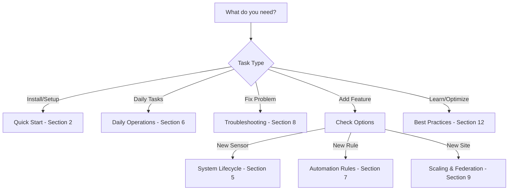
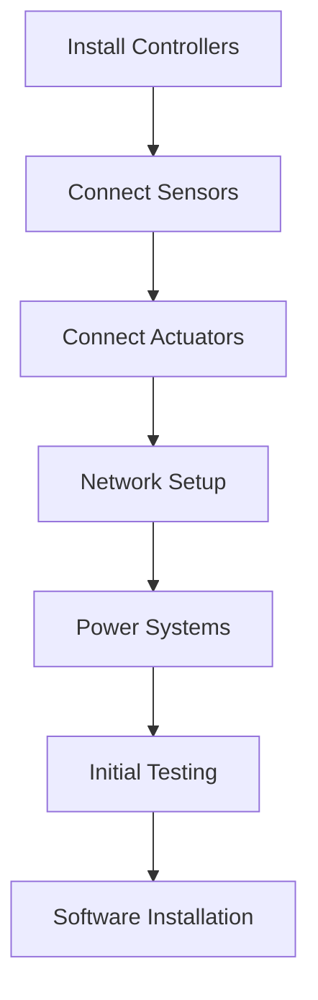
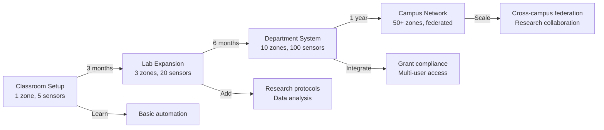

# AGENTS.md - OSCE Agent-Driven Operating Manual

## Living Guide for Human Operators and AI Copilots

> "The best CEA systems are orchestras, not solos. Every agent—human, AI, or software—plays a part in the symphony of growth."

### Version: 4.1.0 | Last Updated: 2024-12-20

---

## 🗺️ OSCE User Journey - Find Your Starting Point

| You Are... | Start Here | Key Sections | Next Steps |
|------------|------------|--------------|------------|
| **New User** | [Quick Start](#quick-start) → [Daily Operations](#daily-operations) | Installation, Basic Rules | [Troubleshooting](#troubleshooting), [Scaling](#scaling) |
| **Experienced Operator** | [Daily Operations](#daily-operations) → [Automation Rules](#automation-rules) | Advanced Rules, Optimization | [Federation](#scaling), [Best Practices](#best-practices) |
| **AI Copilot Developer** | [AI Copilot Integration](#ai-copilot) → [Agent Roles](#agent-roles) | API Setup, Learning Loops | [Automation](#automation-rules), [Compliance](#compliance) |
| **System Administrator** | [System Lifecycle](#system-lifecycle) → [Scaling](#scaling) | Security, Backups, Updates | [Federation](#scaling), [Troubleshooting](#troubleshooting) |
| **Compliance Officer** | [Compliance](#compliance) → [Reporting](#compliance) | Audit Trails, Standards | [Daily Operations](#daily-operations) |
| **Researcher** | [Agent Roles](#agent-roles) → [Best Practices](#best-practices) | Data Collection, Analysis | [AI Integration](#ai-copilot) |

### 🚀 Quick Decision Tree



---

## Table of Contents

1. [Introduction: Your Role in the OSCE Ecosystem](#introduction)
2. [Quick Start: From Zero to Growing](#quick-start)
3. [Core Principles: Modularity, Federation, and Collaboration](#core-principles)
4. [Agent Roles and Responsibilities](#agent-roles)
5. [System Lifecycle: Complete Journey](#system-lifecycle)
6. [Daily Operations Playbook](#daily-operations)
7. [Automation Rules and Recipes](#automation-rules)
8. [Troubleshooting and Recovery](#troubleshooting)
9. [Scaling and Federation](#scaling)
10. [Compliance and Reporting](#compliance)
11. [AI Copilot Integration](#ai-copilot)
12. [Community Best Practices](#best-practices)

---

## 1. Introduction: Your Role in the OSCE Ecosystem {#introduction}

Welcome to OSCE—the WordPress of IoT for Controlled Environment Agriculture. Whether you're a human operator managing a single greenhouse or an AI copilot orchestrating a global network, this guide is your companion.

### Who This Guide Is For

- **Human Operators**: From hobbyists to commercial growers
- **AI Copilots**: LLMs and automation systems managing OSCE deployments
- **System Integrators**: Connecting OSCE to existing infrastructure
- **Developers**: Extending OSCE with plugins and integrations

### How to Use This Guide

- **Humans**: Read sections sequentially for initial setup, then use as reference
- **AI Agents**: Parse structured sections for task-specific guidance
- **Both**: Follow checklists and use templates for consistent operations

### Key Conventions

- 📋 **Checklist**: Step-by-step tasks
- 🤖 **AI Note**: Special instructions for AI copilots
- ⚠️ **Warning**: Critical safety or security information
- 💡 **Tip**: Best practices and optimizations
- 🔧 **Troubleshooting**: Common issues and solutions

---

## 2. Quick Start: From Zero to Growing {#quick-start}

### 📋 Installation Checklist

#### Pre-Installation
- [ ] Verify system requirements (2GB RAM, 10GB storage)
- [ ] Ensure network connectivity
- [ ] Gather hardware information (Raspberry Pi, ESP32, sensors)
- [ ] Prepare credentials storage location

#### Installation Steps
```bash
# 1. Download and verify installer
curl -O https://releases.osce.io/v4/installer.sh
curl -O https://releases.osce.io/v4/installer.sig
gpg --verify installer.sig installer.sh

# 2. Run installer
chmod +x installer.sh
sudo ./installer.sh --install-dir /opt/osce

# 3. Save credentials securely
cat /opt/osce/credentials/credentials.env > ~/osce-credentials.secure
chmod 600 ~/osce-credentials.secure
```

#### Post-Installation
- [ ] Access dashboard: https://github.com/HydroFarmerJason/OpenSourceControlledEnvironments
- [ ] Change default passwords ⚠️ **Critical: Do this immediately!**
- [ ] Configure first zone
- [ ] Test sensor readings
- [ ] Create first automation rule

⚠️ **Common Pitfall**: Many users skip password changes thinking "I'll do it later" - this is the #1 security risk!

### 🤖 AI Copilot Quick Start

```python
# For AI agents managing OSCE
async def setup_osce_instance(config):
    """
    Initialize OSCE for automated management
    
    Args:
        config: Dictionary with deployment parameters
    """
    # 1. Verify prerequisites
    await verify_system_requirements()
    
    # 2. Install OSCE
    result = await run_installer(
        install_dir=config['install_dir'],
        security_level='PRODUCTION'
    )
    
    # 3. Store credentials securely
    creds = await extract_credentials(result)
    await store_in_vault(creds)
    
    # 4. Initialize management connection
    osce_client = OSCEClient(
        url=f"https://{config['hostname']}",
        token=creds['api_token']
    )
    
    # 5. Perform initial configuration
    await configure_zones(osce_client, config['zones'])
    
            return osce_client
```

### 🍳 Quick Recipes - Common Tasks in 60 Seconds

#### Recipe 1: Add a Temperature Sensor with Auto-Control
```bash
# One-liner to add sensor and rule
osce sensor add temp_zone_a --type DHT22 --pin 4 && \
osce rule add "if temp_zone_a > 28 then turn fan_zone_a on"
```

#### Recipe 2: Share Zone Data with Peer Site
```bash
# Enable federation for specific zone
osce federation share --zone "Zone A" --with "site2.farm.com" --data "sensors,alerts"
```

#### Recipe 3: Quick Compliance Check
```bash
# Generate instant compliance status
osce compliance check --standard "GLOBALG.A.P." --quick
```

#### Recipe 4: Emergency Stop All Irrigation
```bash
# Stop all water immediately
osce emergency --stop irrigation --all-zones --reason "Leak detected"
```

#### Recipe 5: Create Morning Report
```bash
# Generate and email morning summary
osce report morning --email team@farm.com --include "alerts,metrics,predictions"
```

#### ⚠️ Common First-Week Pitfalls

1. **Forgot to change default passwords** → Run: `osce security rotate-passwords`
2. **Sensors reading erratic** → Wait 24h for stabilization before calibrating
3. **Rules firing too often** → Add cooldown: `--cooldown 15m` to rules
4. **Network timeouts** → Check firewall allows ports 1883, 8080, 443
5. **Backup not running** → Verify cron job: `crontab -l | grep osce`

---

## 3. Core Principles: Modularity, Federation, and Collaboration {#core-principles}

### Modularity: Building Blocks of Intelligence

**Why It Matters**: No two growing environments are identical. Modularity lets you adapt without rebuilding.

#### Component Types

1. **Hardware Adapters**
   - Auto-discovered or manually configured
   - Hot-swappable without system restart
   - Example: Adding a new CO2 sensor
   ```python
   await env.add_sensor("co2_greenhouse", 
                       sensor_type="MH-Z19",
                       config={'protocol': 'uart', 'pin': 16})
   ```

2. **Plugins**
   - Sandboxed for security
   - Install from registry or custom
   - Example: Weather integration
   ```bash
   osce plugin install weather-integration
   osce plugin configure weather-integration --api-key YOUR_KEY
   ```

3. **Automation Rules**
   - Natural language or code
   - Composable and shareable
   - Example: Temperature control
   ```
   if greenhouse.temperature > 28°C then:
     turn ventilation.fans on
     notify operators "High temperature alert"
   ```

### Federation: Strength in Networks

**Why It Matters**: Isolated systems can't learn from each other or provide redundancy.

#### Federation Levels

1. **Local Federation** (Multiple zones, single site)
   - Shared resources (water, power)
   - Coordinated scheduling
   - Unified dashboard

2. **Regional Federation** (Multiple sites, single organization)
   - Centralized monitoring
   - Best practice sharing
   - Bulk purchasing coordination

3. **Global Federation** (Multiple organizations)
   - Anonymous benchmarking
   - Research collaboration
   - Disaster recovery support

#### Setting Up Federation

```yaml
# federation.yml
federation:
  mode: regional
  security: zero_trust
  sites:
    - name: main_greenhouse
      url: https://main.farm.local
      role: primary
    - name: backup_site
      url: https://backup.farm.local
      role: secondary
  sync:
    - sensor_data: realtime
    - configurations: daily
    - ml_models: weekly
```

### Collaboration: Agents Working Together

**Why It Matters**: Complex systems need specialized agents that communicate effectively.

#### Agent Communication Protocol

```python
# Example: Sensor alerts actuator through coordinator
class TemperatureSensor(Agent):
    async def monitor(self):
        while True:
            temp = await self.read()
            if temp > self.threshold:
                await self.emit_event('high_temperature', {
                    'zone': self.zone,
                    'temperature': temp,
                    'severity': 'warning'
                })
            await asyncio.sleep(60)

class ClimateController(Agent):
    async def on_high_temperature(self, event):
        # Coordinate response
        if event['severity'] == 'warning':
            await self.activate_cooling(level=1)
        elif event['severity'] == 'critical':
            await self.emergency_cooling()
            await self.alert_operators()
```

---

## 4. Agent Roles and Responsibilities {#agent-roles}

### 🎭 Agent Persona Cards - Quick Reference

<div style="display: grid; grid-template-columns: repeat(2, 1fr); gap: 1em;">

#### 🧠 Environment Coordinator
- **Type:** Core System Agent
- **Inputs:** Hardware events, sensor data, user commands
- **Outputs:** Resource allocation, event routing, state updates
- **Decision Cycle:** Real-time (milliseconds)
- **Escalation:** Alert Manager for issues

#### 🔧 Hardware Manager  
- **Type:** System Agent
- **Inputs:** Device connections, health metrics
- **Outputs:** Driver commands, failover actions
- **Decision Cycle:** 100ms for commands, 30s for health
- **Escalation:** Maintenance Tech for failures

#### 🚨 Alert Manager
- **Type:** System Agent  
- **Inputs:** All system events, thresholds
- **Outputs:** Notifications, reports, escalations
- **Decision Cycle:** Real-time to 5 minutes
- **Escalation:** Human operators by severity

#### 📊 Compliance Tracker
- **Type:** Monitoring Agent
- **Inputs:** Operational data, regulations
- **Outputs:** Compliance reports, violation alerts
- **Decision Cycle:** Hourly to daily
- **Escalation:** Compliance Officer immediately

#### ⚡ Energy Optimizer
- **Type:** Optimization Agent
- **Inputs:** Power usage, rate schedules, weather
- **Outputs:** Load scheduling, source switching
- **Decision Cycle:** 15 minutes
- **Escalation:** Facilities Manager

#### 🤖 ML Optimizer
- **Type:** AI Agent
- **Inputs:** Historical data, current state
- **Outputs:** Predictions, recommendations
- **Decision Cycle:** 5 minutes to daily
- **Escalation:** Requires approval for changes

#### 👤 System Administrator
- **Type:** Human Agent
- **Inputs:** System alerts, performance metrics
- **Outputs:** Configuration, updates, fixes
- **Decision Cycle:** On-demand to daily
- **Escalation:** Vendor support

#### 🌱 Grower/Operator  
- **Type:** Human Agent
- **Inputs:** Crop observations, AI recommendations
- **Outputs:** Approvals, adjustments, harvest decisions
- **Decision Cycle:** Multiple times daily
- **Escalation:** Head Grower/Manager

</div>

### Core System Agents

#### 1. Environment Coordinator
**Role**: Orchestrates all zone operations
**Responsibilities**:
- Hardware discovery and initialization
- Resource allocation
- Event routing
- State management

**Key Interfaces**:
```python
coordinator.add_zone(zone_config)
coordinator.get_status()
coordinator.emit_event(event_type, data)
coordinator.handle_emergency(zone, issue)
```

#### 2. Hardware Manager
**Role**: Abstracts hardware complexity
**Responsibilities**:
- Device detection
- Driver management
- Health monitoring
- Failover handling

**Key Interfaces**:
```python
hw_manager.discover_devices()
hw_manager.add_adapter(name, adapter)
hw_manager.get_sensor_reading(sensor_id)
hw_manager.actuate(actuator_id, command)
```

#### 3. Alert Manager
**Role**: Intelligent notification system
**Responsibilities**:
- Alert deduplication
- Severity assessment
- Routing to appropriate channels
- Escalation management

**Alert Severity Levels**:
- `info`: Logged only
- `warning`: Dashboard notification
- `high`: Email/SMS to operators
- `critical`: All channels + emergency protocols

#### 4. Compliance Tracker
**Role**: Regulatory adherence
**Responsibilities**:
- Log retention
- Report generation
- Audit trail maintenance
- Violation detection

**Supported Standards**:
- GLOBALG.A.P.
- Organic Certification
- HACCP
- Custom regulations

#### 5. Energy Optimizer
**Role**: Resource efficiency
**Responsibilities**:
- Load scheduling
- Source prioritization
- Cost optimization
- Carbon tracking

#### 6. ML Optimizer
**Role**: Predictive intelligence
**Responsibilities**:
- Growth prediction
- Failure prediction
- Optimization recommendations
- Pattern recognition

### Human Agent Roles

#### 1. System Administrator
**Responsibilities**:
- System health
- Security updates
- Backup verification
- User management

**Daily Tasks**:
- [ ] Check system health dashboard
- [ ] Review overnight alerts
- [ ] Verify backup completion
- [ ] Check for updates

#### 2. Grower/Operator
**Responsibilities**:
- Crop health monitoring
- Adjustment approvals
- Harvest planning
- Quality control

**Daily Tasks**:
- [ ] Review growth metrics
- [ ] Inspect alert recommendations
- [ ] Approve/modify AI suggestions
- [ ] Log observations

#### 3. Maintenance Technician
**Responsibilities**:
- Sensor calibration
- Actuator testing
- Preventive maintenance
- Repair coordination

**Weekly Tasks**:
- [ ] Calibrate pH/EC sensors
- [ ] Test backup systems
- [ ] Clean sensors
- [ ] Update maintenance log

### AI Copilot Roles

#### 1. Optimization Copilot
```python
class OptimizationCopilot:
    """AI agent for continuous optimization"""
    
    async def daily_optimization(self):
        # Analyze current conditions
        conditions = await self.get_current_conditions()
        
        # Generate recommendations
        recommendations = await self.ml_model.predict_optimal(conditions)
        
        # Apply approved changes
        for rec in recommendations:
            if rec.confidence > 0.95 or rec.pre_approved:
                await self.apply_recommendation(rec)
            else:
                await self.request_human_approval(rec)
```

#### 2. Emergency Response Copilot
```python
class EmergencyResponseCopilot:
    """AI agent for crisis management"""
    
    async def handle_emergency(self, event):
        severity = self.assess_severity(event)
        
        if severity == 'critical':
            # Immediate action
            await self.execute_emergency_protocol(event)
            await self.notify_all_operators()
            
        # Log for learning
        await self.log_incident(event)
```

---

## 5. System Lifecycle: Complete Journey {#system-lifecycle}

### Phase 1: Planning and Design

#### 📋 Planning Checklist
- [ ] Define growing zones and crops
- [ ] List required sensors per zone
- [ ] Plan actuator placement
- [ ] Design network topology
- [ ] Estimate resource needs
- [ ] Set compliance requirements

#### Zone Planning Template
```yaml
zone:
  name: "Tomato House A"
  dimensions:
    length_m: 30
    width_m: 10
    height_m: 4
  crops:
    - type: tomato
      variety: "Cherokee Purple"
      count: 500
      spacing_cm: 45
  environmental_targets:
    temperature:
      day: 24-26°C
      night: 18-20°C
    humidity: 65-75%
    co2_ppm: 800-1200
  sensors_needed:
    - temperature: 4 units
    - humidity: 4 units
    - soil_moisture: 20 units
    - co2: 2 units
    - light_par: 4 units
  actuators_needed:
    - irrigation_valves: 10
    - ventilation_fans: 4
    - heating: 2 units
    - grow_lights: 20 units
```

### Phase 2: Installation and Setup

#### Hardware Installation Flow


#### 🔧 Hardware Setup Tips
- **Controllers**: Place in weatherproof enclosures with ventilation
- **Sensors**: Allow 24h stabilization before calibration
- **Network**: Use wired connections for critical paths
- **Power**: Include UPS for controllers and network

### Phase 3: Configuration and Calibration

#### Sensor Calibration Procedure
```python
# Example: pH sensor calibration
async def calibrate_ph_sensor(sensor_id):
    """Three-point calibration procedure"""
    
    print("=== pH Sensor Calibration ===")
    
    # ⚠️ Common Pitfall: Calibrating immediately after installation
    # Sensors need 24h to stabilize! Check sensor age:
    sensor_age = await get_sensor_age(sensor_id)
    if sensor_age < timedelta(hours=24):
        print("⚠️  WARNING: Sensor installed less than 24h ago")
        print("   Calibration may be inaccurate. Continue anyway? (y/n)")
        if input().lower() != 'y':
            return
    
    # Calibration points
    buffers = [4.0, 7.0, 10.0]
    readings = []
    
    for buffer_ph in buffers:
        input(f"Place sensor in pH {buffer_ph} buffer and press Enter...")
        
        # Take multiple readings
        values = []
        for _ in range(10):
            value = await hw_manager.get_sensor_reading(sensor_id)
            values.append(value)
            await asyncio.sleep(1)
        
        avg_reading = np.mean(values)
        readings.append((buffer_ph, avg_reading))
        print(f"Buffer pH {buffer_ph}: Raw reading {avg_reading:.3f}")
    
    # Calculate calibration curve
    calibration = calculate_calibration_curve(readings)
    
    # Apply calibration
    await sensor.set_calibration(calibration)
    print("Calibration complete!")
    
    return calibration
```

### Phase 4: Initial Operation

#### First Week Checklist
- [ ] **Day 1**: Monitor all sensors for stability
- [ ] **Day 2**: Test each actuator manually
- [ ] **Day 3**: Enable basic automation rules
- [ ] **Day 4**: Verify data logging and backups
- [ ] **Day 5**: Test alert systems
- [ ] **Day 6**: Enable advanced features
- [ ] **Day 7**: Generate first weekly report

### Phase 5: Optimization and Learning

#### Optimization Cycle
1. **Collect**: Gather 2-4 weeks of baseline data
2. **Analyze**: Identify patterns and inefficiencies
3. **Model**: Train ML models on your specific environment
4. **Test**: Run optimizations in simulation
5. **Deploy**: Gradually apply optimizations
6. **Monitor**: Track improvements
7. **Iterate**: Refine based on results

#### 💡 Optimization Targets
- **Energy**: Reduce consumption by 20-30%
- **Water**: Optimize irrigation timing and volume
- **Yield**: Increase by 10-15% through environmental optimization
- **Quality**: Improve consistency and reduce defects

### Phase 6: Scaling and Expansion

#### Scaling Decision Matrix
| Current Scale | Growth Target | Recommended Approach |
|--------------|---------------|---------------------|
| 1 zone | 2-5 zones | Add zones to existing system |
| 5 zones | 10+ zones | Implement zone grouping |
| Single site | Multi-site | Enable federation |
| Regional | Global | Deploy edge computing |

### Phase 7: Maintenance and Evolution

#### Maintenance Schedule Template
```yaml
maintenance_schedule:
  daily:
    - check_alerts: "Review and acknowledge"
    - visual_inspection: "Walk through all zones"
    - data_verification: "Confirm sensors reporting"
  
  weekly:
    - sensor_cleaning: "Clean all optical sensors"
    - actuator_test: "Cycle all actuators"
    - backup_verification: "Test restore procedure"
    - report_generation: "Review weekly metrics"
  
  monthly:
    - sensor_calibration: "Recalibrate pH, EC"
    - system_updates: "Apply security patches"
    - performance_review: "Analyze efficiency"
    - ml_model_retraining: "Update with new data"
  
  quarterly:
    - full_system_audit: "Complete inspection"
    - disaster_recovery_test: "Simulate failure"
    - compliance_audit: "Verify all logs"
    - strategic_planning: "Review and adjust goals"
```

---

## 6. Daily Operations Playbook {#daily-operations}

### Morning Routine (6:00 AM)

#### 🤖 Automated Morning Tasks
```python
async def morning_routine():
    """Automated morning system check and optimization"""
    
    # 1. System health check
    health = await system.comprehensive_health_check()
    
    # 2. Overnight event summary
    events = await alert_manager.get_overnight_summary()
    
    # 3. Environmental adjustment for day mode
    for zone in zones:
        await zone.transition_to_day_mode()
    
    # 4. Generate morning report
    report = await generate_morning_report(health, events)
    
    # 5. Optimize day schedule
    schedule = await energy_optimizer.plan_daily_schedule()
    
    # 6. Send to operators
    await notify_operators(report, schedule)
```

#### 📋 Human Morning Checklist
- [ ] Review morning report on dashboard
- [ ] Check plant health visually
- [ ] Verify critical sensor readings
- [ ] Approve/modify AI recommendations
- [ ] Log any observations

### Midday Operations (12:00 PM)

#### Peak Management Protocol
```python
async def peak_hours_management():
    """Manage resources during peak demand"""
    
    # Stagger high-power operations
    zones_by_priority = sort_zones_by_crop_sensitivity()
    
    for i, zone in enumerate(zones_by_priority):
        # Offset HVAC cycles
        delay = i * 10  # 10-minute offset
        await asyncio.sleep(delay * 60)
        
        # Adjust for peak conditions
        await zone.enable_peak_mode()
```

### Evening Routine (6:00 PM)

#### Transition to Night Mode
```yaml
night_mode_settings:
  temperature:
    reduction: 4°C
    rate: 0.5°C per 30min
  lighting:
    sunset_simulation: true
    duration: 30min
  irrigation:
    enabled: false  # Unless scheduled
  ventilation:
    mode: minimum
    humidity_control: active
```

### Night Operations (10:00 PM - 6:00 AM)

#### 🤖 Automated Night Tasks
- Energy-saving mode activation
- Predictive maintenance scans
- Database optimization
- ML model training
- Backup operations

---

## 7. Automation Rules and Recipes {#automation-rules}

### Rule Writing Guide

#### Basic Rule Structure
```
if <condition> then <action>
```

#### Advanced Rule Structure
```
when <trigger>
  if <conditions>
  then
    <action1>
    <action2>
    wait <duration>
    <action3>
  else
    <alternative_action>
  notify <recipients>
```

### Environmental Control Recipes

#### 1. Temperature Management
```yaml
# Basic temperature control
rule: maintain_temperature
  trigger: every 5 minutes
  conditions:
    - sensor: zone_a.temperature_avg
      above: 28°C
  actions:
    - turn: ventilation_fans on
    - set: shade_cloth to 50%
  until:
    - sensor: zone_a.temperature_avg
      below: 26°C
  
  # ⚠️ Common Pitfall: No cooldown period!
  # This rule could cycle fans on/off rapidly
  # Better version includes cooldown:
  cooldown: 15 minutes  # Prevent rapid cycling
```

#### 2. Humidity Control
```yaml
# VPD-based humidity control
rule: optimize_vpd
  trigger: every 10 minutes
  calculate:
    vpd: vapor_pressure_deficit(temperature, humidity)
  conditions:
    - calculated: vpd
      outside_range: [0.8, 1.2] kPa
  actions:
    - if: vpd < 0.8
      then: 
        - increase: ventilation by 20%
        - decrease: misting by 50%
    - if: vpd > 1.2
      then:
        - decrease: ventilation by 20%
        - increase: misting by 30%
```

#### 3. Irrigation Automation
```python
# Soil moisture-based irrigation with weather integration
async def smart_irrigation_rule(zone):
    """Advanced irrigation considering multiple factors"""
    
    # Get sensor data
    moisture_levels = await zone.get_soil_moisture_array()
    avg_moisture = np.mean(moisture_levels)
    
    # Get weather forecast
    forecast = await weather_plugin.get_forecast(hours=24)
    rain_expected = forecast.precipitation_mm > 5
    
    # Get plant stage
    plant_age_days = (datetime.now() - zone.planting_date).days
    water_need_multiplier = get_water_needs_by_stage(plant_age_days)
    
    # Decision logic
    threshold = 30 * water_need_multiplier  # Base threshold 30%
    
    if avg_moisture < threshold and not rain_expected:
        # Calculate irrigation duration
        deficit = threshold - avg_moisture
        duration_minutes = deficit * 0.5  # 0.5 min per % deficit
        
        # Execute irrigation
        await zone.irrigate(duration_minutes)
        
        # Log decision
        await log_irrigation_event({
            'zone': zone.name,
            'trigger': 'moisture_deficit',
            'moisture': avg_moisture,
            'duration': duration_minutes,
            'reasoning': f'Deficit of {deficit}%, no rain expected'
        })
```

### Crop-Specific Recipes

#### 🍅 Tomato Growing Recipe
```yaml
tomato_recipe:
  name: "Indeterminate Tomatoes - Optimal Growth"
  
  stages:
    seedling:
      duration_days: 14
      temperature:
        day: 24°C
        night: 20°C
      humidity: 70-80%
      light:
        intensity: 200 μmol/m²/s
        photoperiod: 16h
      irrigation: "Keep moist, not waterlogged"
    
    vegetative:
      duration_days: 30
      temperature:
        day: 25°C
        night: 18°C
      humidity: 65-75%
      light:
        intensity: 400 μmol/m²/s
        photoperiod: 18h
      fertilizer:
        n_p_k: "3-1-2"
        ec: 2.0-2.5
      
    flowering:
      duration_days: 20
      temperature:
        day: 26°C
        night: 16°C  # Cool nights for fruit set
      humidity: 60-70%
      co2: 1000 ppm
      pollination:
        method: "vibration"
        frequency: "daily at 10am"
    
    fruiting:
      duration_days: 60+
      temperature:
        day: 24°C
        night: 18°C
      humidity: 60-65%
      light:
        intensity: 600 μmol/m²/s
        photoperiod: 16h
      fertilizer:
        n_p_k: "2-1-3"  # More K for fruit
        ec: 2.5-3.0
      
  alerts:
    - condition: "temperature > 30°C during flowering"
      severity: critical
      message: "High temp will reduce fruit set!"
    
    - condition: "humidity > 85% for 4h"
      severity: high
      message: "Fungal disease risk!"
```

#### 🥬 Lettuce NFT Recipe
```yaml
lettuce_nft_recipe:
  name: "Buttercrunch Lettuce - 35 Day Cycle"
  
  system: "NFT channels"
  
  stages:
    germination:
      duration_days: 7
      environment: "Germination chamber"
      temperature: 20°C
      humidity: 100%
      
    nursery:
      duration_days: 14
      temperature: 22°C
      light:
        intensity: 150 μmol/m²/s
        photoperiod: 14h
      nutrient_solution:
        ec: 1.2
        ph: 5.8
        
    production:
      duration_days: 14
      temperature:
        day: 20°C
        night: 16°C
      light:
        intensity: 200 μmol/m²/s
        photoperiod: 16h
        spectrum: "Full spectrum + far red"
      nutrient_solution:
        ec: 1.8
        ph: 5.8-6.0
        flow_rate: "1L/min per channel"
        
  automation_rules:
    - name: "pH control"
      if: "pH > 6.2"
      then: "dose pH_down until pH < 6.0"
      
    - name: "EC control"
      if: "EC < 1.6"
      then: "dose nutrients until EC = 1.8"
      
    - name: "Temperature optimization"
      if: "light_status = on AND temp > 22°C"
      then: "increase cooling by 20%"
```

### Energy Optimization Rules

#### Peak Shaving Algorithm
```python
async def peak_shaving_rule():
    """Reduce energy consumption during peak rate hours"""
    
    # Peak hours definition (utility-specific)
    peak_hours = range(14, 19)  # 2 PM - 7 PM
    current_hour = datetime.now().hour
    
    if current_hour in peak_hours:
        # Get current load
        current_load_kw = await energy_monitor.get_current_load()
        peak_limit_kw = 50  # Contract limit
        
        if current_load_kw > peak_limit_kw * 0.9:  # 90% of limit
            # Start shedding loads by priority
            sheddable_loads = await get_sheddable_loads()
            
            for load in sorted(sheddable_loads, key=lambda x: x.priority):
                if current_load_kw <= peak_limit_kw * 0.8:
                    break
                    
                await load.reduce_by_percent(30)
                current_load_kw = await energy_monitor.get_current_load()
                
                await log_event('peak_shaving', {
                    'load_reduced': load.name,
                    'new_total_kw': current_load_kw
                })
```

### Integration Rules

#### Weather-Based Adaptation
```yaml
weather_adaptation:
  - trigger: weather_forecast_updated
    rules:
      - name: "Storm preparation"
        if: 
          - forecast.wind_speed > 60 km/h
          - forecast.timeframe < 4 hours
        then:
          - secure: vents to 'closed'
          - set: shade_cloth to 'retracted'
          - notify: operators 'Storm preparation completed'
          
      - name: "Heat wave response"
        if:
          - forecast.temperature > 35°C
          - forecast.duration > 2 days
        then:
          - increase: shade_cloth to 70%
          - set: misting to 'frequent'
          - adjust: irrigation +20%
          - alert: operators 'Heat wave protocol activated'
```

---

## 8. Troubleshooting and Recovery {#troubleshooting}

### Common Issues and Solutions

#### 🔧 Sensor Issues

**Problem**: Sensor reading stuck or erratic
```bash
# Diagnostic steps
osce diagnose sensor <sensor_id>

# Common solutions
1. Check physical connection
2. Clean sensor surface
3. Recalibrate
4. Replace if failed

# Automated recovery
osce sensor enable-fallback <sensor_id>
```

**Problem**: I2C devices not detected
```python
# I2C troubleshooting script
async def diagnose_i2c():
    """Diagnose I2C communication issues"""
    
    print("=== I2C Diagnostics ===")
    
    # 1. Check I2C is enabled
    if not os.path.exists('/dev/i2c-1'):
        print("❌ I2C not enabled. Run: sudo raspi-config")
        return
        
    # 2. Scan for devices
    devices = await hw_manager.i2c_scan()
    print(f"✓ Found {len(devices)} devices: {[hex(d) for d in devices]}")
    
    # 3. Check pull-up resistors
    if len(devices) == 0:
        print("⚠️  No devices found. Check:")
        print("   - Pull-up resistors (2.2kΩ - 10kΩ)")
        print("   - Power to sensors")
        print("   - SDA/SCL connections")
    
    # 4. Test each device
    for addr in devices:
        try:
            # Attempt read
            await hw_manager.i2c_read(addr, 0x00)
            print(f"✓ Device at {hex(addr)} responding")
        except Exception as e:
            print(f"❌ Device at {hex(addr)} error: {e}")
```

#### 🔧 Actuator Issues

**Problem**: Actuator not responding
```yaml
actuator_diagnostic:
  steps:
    1. check_power:
        command: "measure voltage at actuator"
        expected: "Within 10% of rated voltage"
        
    2. test_control_signal:
        command: "osce actuator test <actuator_id>"
        verify: "Signal reaches actuator"
        
    3. manual_override:
        command: "osce actuator override <actuator_id> on"
        verify: "Actuator operates"
        
    4. check_safety_limits:
        command: "osce actuator show-limits <actuator_id>"
        action: "Adjust if too restrictive"
```

#### 🔧 Network Issues

**Problem**: Remote node disconnected
```python
# Automatic reconnection handler
class NetworkRecovery:
    async def handle_disconnection(self, node_id):
        """Attempt to recover disconnected node"""
        
        max_attempts = 5
        backoff = 1
        
        for attempt in range(max_attempts):
            try:
                # Attempt reconnection
                await self.reconnect_node(node_id)
                
                # Verify connection
                if await self.ping_node(node_id):
                    await self.log_recovery(node_id, attempt)
                    return True
                    
            except Exception as e:
                await asyncio.sleep(backoff)
                backoff *= 2  # Exponential backoff
                
        # Failed to reconnect
        await self.escalate_to_operator(node_id)
        await self.enable_fallback_mode(node_id)
        return False
```

### System Recovery Procedures

#### 🚨 Emergency Recovery

**Power Failure Recovery**
```bash
#!/bin/bash
# Power restoration script

# 1. Wait for systems to stabilize
sleep 60

# 2. Check core services
systemctl status osce
systemctl status docker

# 3. Restart if needed
if ! systemctl is-active osce; then
    systemctl start osce
fi

# 4. Verify critical systems
osce health-check --critical

# 5. Resume automation gradually
osce automation enable --staged
```

### 🌐 Federation Troubleshooting Playbook

#### Quick Reference - Federation Issues

| Symptom | First Check | Quick Fix | Escalation |
|---------|-------------|-----------|------------|
| **Sync Failed** | `osce federation status` | `osce federation sync --force` | Check network connectivity |
| **Certificate Mismatch** | `osce federation verify-certs` | `osce federation exchange-certs --site X` | Regenerate certificates |
| **Primary Site Down** | `osce federation heartbeat` | `osce federation promote-secondary` | Execute DR plan |
| **Data Inconsistency** | `osce federation compare --site X` | `osce federation resync --from primary` | Manual reconciliation |
| **Network Partition** | `ping other-site.com` | Enable autonomous mode | Contact network team |

#### Detailed Federation Recovery Procedures

##### Scenario 1: Primary Site Failure
```bash
# On secondary site - automatic failover
#!/bin/bash

# 1. Detect primary failure (automatic)
if ! osce federation ping primary --timeout 30; then
    
    # 2. Verify with multiple checks
    if osce federation verify-primary-down; then
        
        # 3. Promote secondary to primary
        osce federation promote-to-primary
        
        # 4. Notify all sites
        osce federation broadcast "PRIMARY_CHANGE:$(hostname)"
        
        # 5. Start accepting writes
        osce federation accept-writes --enable
        
        # 6. Alert humans
        osce alert send --priority critical \
            --message "Primary site failed over to $(hostname)"
    fi
fi
```

##### Scenario 2: Certificate Issues
```python
# Certificate troubleshooting helper
async def diagnose_cert_issues():
    """Step-by-step certificate diagnosis"""
    
    print("🔐 Certificate Diagnostic Tool")
    
    # 1. Check local certificates
    local_cert = await get_local_certificate()
    print(f"✓ Local cert valid until: {local_cert.expiry}")
    
    # 2. Check peer certificates  
    for site in federation_sites:
        try:
            peer_cert = await get_peer_certificate(site)
            if verify_certificate(peer_cert):
                print(f"✓ {site}: Valid")
            else:
                print(f"✗ {site}: Invalid - regenerate with:")
                print(f"  osce federation regenerate-cert --site {site}")
        except Exception as e:
            print(f"✗ {site}: Unreachable - {e}")
            
    # 3. Test secure communication
    for site in federation_sites:
        if await test_secure_channel(site):
            print(f"✓ Secure channel to {site} working")
        else:
            print(f"✗ Cannot establish secure channel to {site}")
            print("  Try: osce federation reset-channel --site {site}")
```

##### Scenario 3: Split-Brain Resolution
```yaml
# Split-brain recovery procedure
split_brain_recovery:
  detection:
    - symptom: "Multiple sites claiming primary role"
    - check: "osce federation show-primary --all-sites"
    
  resolution:
    1_isolate:
      - command: "osce federation isolate --all"
      - purpose: "Stop writes on all sites"
      
    2_identify_authority:
      - method: "Check transaction timestamps"
      - command: "osce federation compare-transactions"
      - decision: "Site with most recent valid data"
      
    3_reconcile:
      - designate_primary: "osce federation force-primary --site X"
      - sync_others: "osce federation sync-from --site X"
      
    4_verify:
      - check_consistency: "osce federation verify-consistency"
      - test_writes: "osce federation test-write"
      
    5_resume:
      - enable_federation: "osce federation enable"
      - monitor: "Watch for 30 minutes"
```

### Database Corruption Recovery
```python
async def recover_database():
    """Recover from database corruption"""
    
    # 1. Stop writes
    await system.enable_readonly_mode()
    
    # 2. Identify corruption
    corruption = await db.check_integrity()
    
    if corruption.severity == 'minor':
        # Attempt repair
        await db.repair_tables(corruption.affected_tables)
        
    elif corruption.severity == 'major':
        # Restore from backup
        latest_backup = await backup_manager.get_latest()
        await backup_manager.restore(latest_backup)
        
        # Replay recent data from MQTT retention
        await replay_recent_data()
    
    # 3. Verify integrity
    if await db.check_integrity().is_clean:
        await system.disable_readonly_mode()
        return True
    
    return False
```

### Performance Optimization

#### 🔧 Slow System Response

**Diagnostic Checklist**
- [ ] Check CPU usage: `osce metrics cpu`
- [ ] Check memory: `osce metrics memory`
- [ ] Check disk I/O: `osce metrics disk`
- [ ] Review running plugins: `osce plugin list --active`
- [ ] Check database size: `osce db stats`

**Common Solutions**
```bash
# 1. Clean old data
osce db cleanup --older-than 90d

# 2. Optimize database
osce db optimize

# 3. Disable unnecessary plugins
osce plugin disable <plugin_name>

# 4. Increase resources
docker update --memory 4g osce-core
```

---

## 9. Scaling and Federation {#scaling}

### 🏆 Golden Paths for Scaling - From Classroom to Commercial

#### Path 1: Educational Institution → Research Facility


**Milestone Checklist:**
- [ ] **Month 1-3**: Master basic operations, achieve 95% uptime
- [ ] **Month 4-6**: Implement first research protocol, publish data
- [ ] **Month 7-12**: Federation with 2+ labs, standardize procedures
- [ ] **Year 2**: Full campus deployment, external collaborations

#### Path 2: Home Hobbyist → Commercial Producer
```yaml
scaling_journey:
  stage_1_hobby:
    duration: "6 months"
    scale: "1-2 grow tents"
    investment: "$500"
    focus:
      - Learn system basics
      - Test crop varieties
      - Build knowledge
    milestone: "Consistent harvests"
    
  stage_2_prosumer:
    duration: "6-12 months"
    scale: "Garage/basement setup"
    investment: "$2,000-5,000"
    focus:
      - Efficiency optimization
      - Multiple crop types
      - Local sales testing
    milestone: "Break-even on operations"
    
  stage_3_commercial:
    duration: "12-24 months"
    scale: "Dedicated facility"
    investment: "$20,000-50,000"
    focus:
      - Compliance systems
      - Staff training
      - Market relationships
    milestone: "Profitable operations"
    
  stage_4_enterprise:
    duration: "Ongoing"
    scale: "Multiple facilities"
    investment: "$100,000+"
    focus:
      - Federation setup
      - Supply chain integration
      - Brand development
    milestone: "Regional market leader"
```

#### Path 3: Single Site → Multi-National Operation

**Year 1: Foundation**
```bash
# Single site optimization
- Perfect operations at one location
- Document all procedures
- Train core team
- Achieve certifications

# Key metrics to hit:
- 99% uptime
- <2% crop loss
- 30% resource savings vs traditional
```

**Year 2: Replication**
```bash
# Second site deployment
osce federation prepare --mode primary-secondary
osce site deploy --template site1 --location site2

# Learnings integration
- Sync best practices
- Unified dashboards
- Shared ML models
- Cross-site team training
```

**Year 3: Network Effects**
```python
# Multi-site optimization
sites = ['usa-east', 'usa-west', 'canada', 'mexico']

for site in sites:
    # Deploy with regional adaptations
    deploy_config = base_config.adapt_to_region(site)
    osce.deploy_site(site, deploy_config)
    
    # Establish federation
    osce.federate(primary='usa-east', secondary=site)
    
# Network benefits:
# - Shared R&D costs
# - Bulk purchasing power  
# - Risk distribution
# - 24/7 operations coverage
```

**Year 4-5: Global Platform**
```yaml
global_operation:
  regions:
    americas:
      hubs: ['usa', 'brazil', 'mexico']
      crops: ['tomatoes', 'lettuce', 'herbs']
      
    europe:
      hubs: ['netherlands', 'spain', 'uk']
      crops: ['cucumbers', 'peppers', 'flowers']
      
    asia_pacific:
      hubs: ['japan', 'singapore', 'australia']
      crops: ['leafy_greens', 'strawberries', 'mushrooms']
      
  integration:
    - unified_brand: true
    - shared_r&d: true
    - global_dashboard: true
    - regional_autonomy: true
    
  benefits:
    - market_resilience: "Regional supply chain flexibility"
    - innovation_speed: "24/7 R&D across time zones"
    - cost_efficiency: "Shared infrastructure and knowledge"
    - risk_mitigation: "Geographic and crop diversity"
```

### Scaling Strategies

#### Vertical Scaling (Single Site)

**When to Use**: 
- Growing from 1-10 zones
- Single location
- Limited IT resources

**Implementation**:
```yaml
# Scaling configuration
scaling:
  mode: vertical
  resources:
    cpu_cores: 8
    memory_gb: 16
    storage_tb: 2
  optimizations:
    - database_partitioning: true
    - sensor_data_aggregation: 5min
    - plugin_lazy_loading: true
```

#### Horizontal Scaling (Multi-Site)

**When to Use**:
- Multiple locations
- 10+ zones
- High availability requirements

**Architecture**:
```
┌─────────────┐     ┌─────────────┐     ┌─────────────┐
│   Site A    │     │   Site B    │     │   Site C    │
│  (Primary)  │────▶│ (Secondary) │────▶│  (Tertiary) │
└─────────────┘     └─────────────┘     └─────────────┘
       │                   │                    │
       └───────────────────┴────────────────────┘
                          │
                   ┌──────────────┐
                   │ Central Cloud │
                   │  Monitoring   │
                   └──────────────┘
```

### Federation Setup

#### 1. Prepare Sites for Federation

```bash
# On each site
osce federation prepare \
  --site-name "greenhouse_west" \
  --site-role "secondary" \
  --primary-url "https://main.farm.com"
```

#### 2. Establish Trust

```python
# Certificate exchange
async def establish_federation_trust():
    """Secure certificate exchange between sites"""
    
    # Generate site certificate
    site_cert = await security_manager.generate_site_certificate()
    
    # Exchange with primary
    primary_cert = await primary_site.exchange_certificates(site_cert)
    
    # Verify and store
    if await security_manager.verify_certificate(primary_cert):
        await security_manager.trust_certificate(primary_cert)
        return True
    
    return False
```

#### 3. Configure Synchronization

```yaml
# federation-sync.yml
synchronization:
  sensor_data:
    mode: streaming
    compression: true
    retention_days: 7
    
  configurations:
    mode: periodic
    interval: 1h
    conflict_resolution: newest_wins
    
  ml_models:
    mode: on_demand
    approval_required: true
    
  plugins:
    mode: manual
    allowed_sources:
      - official_registry
      - trusted_sites
```

### Multi-Site Coordination

#### Resource Sharing Protocol

```python
class ResourceCoordinator:
    """Coordinate resources across federated sites"""
    
    async def balance_resources(self):
        """Balance load across sites"""
        
        # Get resource usage from all sites
        site_resources = await self.gather_resource_stats()
        
        # Identify imbalances
        overloaded = [s for s in site_resources if s.load > 0.8]
        underutilized = [s for s in site_resources if s.load < 0.3]
        
        if overloaded and underutilized:
            # Migrate workloads
            for task in overloaded[0].sheddable_tasks:
                if await underutilized[0].can_accept(task):
                    await self.migrate_task(task, 
                                          from_site=overloaded[0],
                                          to_site=underutilized[0])
```

#### Disaster Recovery

```yaml
# Disaster recovery plan
disaster_recovery:
  scenarios:
    - type: "Primary site failure"
      detection: "No heartbeat for 5 minutes"
      response:
        1: "Secondary promotes to primary"
        2: "Tertiary becomes new secondary"
        3: "Alert all operators"
        4: "Start recovery procedures"
        
    - type: "Network partition"
      detection: "Sites can't communicate"
      response:
        1: "Each site enters autonomous mode"
        2: "Queue synchronization data"
        3: "Prevent configuration changes"
        4: "Alert network team"
        
    - type: "Data corruption"
      detection: "Checksum mismatch"
      response:
        1: "Isolate affected site"
        2: "Restore from nearest healthy site"
        3: "Verify data integrity"
        4: "Resume operations"
```

---

## 10. Compliance and Reporting {#compliance}

### Regulatory Framework

#### Supported Standards

| Standard | Requirements | OSCE Implementation |
|----------|-------------|---------------------|
| GLOBALG.A.P. | Traceability, food safety | Automatic lot tracking |
| Organic | No synthetic inputs | Input verification system |
| HACCP | Hazard analysis | Risk monitoring alerts |
| ISO 22000 | Food safety management | Built-in workflows |

### Compliance Configuration

```yaml
# compliance-config.yml
compliance:
  standards:
    - name: "GLOBALG.A.P."
      version: "5.2"
      modules:
        - crops_base
        - food_safety
        - traceability
      
  record_keeping:
    retention_years: 5
    formats:
      - pdf
      - csv
      - blockchain_proof
      
  audit_trail:
    enabled: true
    immutable: true
    blockchain: 
      network: "hyperledger"
      channel: "farm_audit"
      
  automated_checks:
    - pesticide_applications:
        pre_harvest_interval: true
        approved_list_check: true
        
    - water_quality:
        parameters: ["ph", "ec", "coliforms"]
        frequency: "weekly"
        
    - worker_hygiene:
        training_records: true
        health_certificates: true
```

### Automated Compliance Monitoring

```python
class ComplianceMonitor:
    """Continuous compliance monitoring"""
    
    async def daily_compliance_check(self):
        """Run daily compliance verification"""
        
        report = ComplianceReport()
        
        # Check record completeness
        for standard in self.standards:
            missing_records = await self.check_required_records(standard)
            if missing_records:
                report.add_violation(
                    standard=standard.name,
                    issue="Missing records",
                    details=missing_records,
                    severity="medium"
                )
        
        # Verify operational compliance
        violations = await self.check_operational_compliance()
        report.add_violations(violations)
        
        # Generate report
        if report.has_violations():
            await self.alert_compliance_officer(report)
        
        await self.store_compliance_report(report)
        
        return report
```

### Report Generation

#### Executive Dashboard Template

```html
<!-- Executive Dashboard HTML Template -->
<div class="executive-dashboard">
  <header>
    <h1>{{ farm_name }} - Executive Overview</h1>
    <p>Report Period: {{ start_date }} to {{ end_date }}</p>
  </header>
  
  <section class="kpi-summary">
    <div class="kpi-card">
      <h3>Total Yield</h3>
      <p class="value">{{ total_yield_kg }} kg</p>
      <p class="change {{ yield_change_class }}">
        {{ yield_change_percent }}% vs last period
      </p>
    </div>
    
    <div class="kpi-card">
      <h3>Resource Efficiency</h3>
      <p class="value">{{ water_per_kg }} L/kg</p>
      <p class="subtitle">Water usage</p>
      <p class="value">{{ kwh_per_kg }} kWh/kg</p>
      <p class="subtitle">Energy usage</p>
    </div>
    
    <div class="kpi-card">
      <h3>Quality Metrics</h3>
      <p class="value">{{ grade_a_percent }}%</p>
      <p class="subtitle">Grade A produce</p>
      <p class="value">{{ rejection_rate }}%</p>
      <p class="subtitle">Rejection rate</p>
    </div>
  </section>
  
  <section class="alerts-summary">
    <h2>Critical Alerts (Last 7 Days)</h2>
    <ul>
      
      <li class="alert-{{ alert.severity }}">
        {{ alert.timestamp }}: {{ alert.message }}
      </li>
      
    </ul>
  </section>
  
  <section class="compliance-status">
    <h2>Compliance Status</h2>
    <div class="compliance-grid">
      
      <div class="compliance-card">
        <h4>{{ standard.name }}</h4>
        <div class="status-indicator {{ standard.status }}">
          {{ standard.score }}%
        </div>
        <p>Next audit: {{ standard.next_audit }}</p>
      </div>
      
    </div>
  </section>
</div>
```

#### Automated Report Distribution

```python
async def distribute_reports():
    """Automated report generation and distribution"""
    
    # Daily reports
    if datetime.now().hour == 7:  # 7 AM
        daily_report = await generate_daily_report()
        
        recipients = await get_report_recipients('daily')
        for recipient in recipients:
            await send_report(recipient, daily_report)
    
    # Weekly reports (Mondays)
    if datetime.now().weekday() == 0 and datetime.now().hour == 8:
        weekly_report = await generate_weekly_report()
        
        # Include trend analysis
        weekly_report.add_section(await analyze_weekly_trends())
        
        recipients = await get_report_recipients('weekly')
        for recipient in recipients:
            await send_report(recipient, weekly_report)
    
    # Monthly reports (1st of month)
    if datetime.now().day == 1 and datetime.now().hour == 9:
        monthly_report = await generate_monthly_report()
        
        # Include financial analysis
        monthly_report.add_section(await calculate_monthly_financials())
        
        # Include compliance summary
        monthly_report.add_section(await generate_compliance_summary())
        
        recipients = await get_report_recipients('monthly')
        for recipient in recipients:
            await send_report(recipient, monthly_report)
```

---

## 11. AI Copilot Integration {#ai-copilot}

### Setting Up AI Copilot

#### 1. API Configuration

```python
# ai_copilot_config.py
class AICopilotConfig:
    """Configuration for AI copilot integration"""
    
    # API endpoints
    api_base_url = "https://github.com/HydroFarmerJason/OpenSourceControlledEnvironments"
    
    # Authentication
    api_key = os.getenv("OSCE_API_KEY")
    
    # Permissions
    allowed_operations = [
        "read_sensors",
        "read_actuators", 
        "suggest_optimizations",
        "generate_reports",
        "send_alerts"
    ]
    
    # Restricted operations (require human approval)
    restricted_operations = [
        "modify_setpoints",
        "change_schedules",
        "update_rules",
        "system_configuration"
    ]
```

#### 2. AI Agent Implementation

```python
class OSCEAICopilot:
    """AI agent for OSCE management"""
    
    def __init__(self, config: AICopilotConfig):
        self.config = config
        self.client = OSCEClient(config.api_base_url, config.api_key)
        self.learning_enabled = True
        self.decision_log = []
        
    async def monitor_and_optimize(self):
        """Main monitoring and optimization loop"""
        
        while True:
            try:
                # 1. Collect current state
                state = await self.get_system_state()
                
                # 2. Analyze for issues
                issues = await self.analyze_state(state)
                
                # 3. Generate recommendations
                recommendations = await self.generate_recommendations(state, issues)
                
                # 4. Apply approved actions
                for rec in recommendations:
                    if await self.should_apply(rec):
                        result = await self.apply_recommendation(rec)
                        await self.log_decision(rec, result)
                
                # 5. Learn from outcomes
                if self.learning_enabled:
                    await self.update_knowledge_base()
                
                await asyncio.sleep(300)  # 5-minute cycle
                
            except Exception as e:
                await self.handle_error(e)
    
    async def analyze_state(self, state: SystemState) -> List[Issue]:
        """Analyze system state for issues and opportunities"""
        
        issues = []
        
        # Check sensor health
        for sensor in state.sensors:
            if sensor.health_score < 0.8:
                issues.append(Issue(
                    type="sensor_degradation",
                    severity="medium",
                    component=sensor.id,
                    description=f"Sensor {sensor.name} showing degradation"
                ))
        
        # Check environmental conditions
        for zone in state.zones:
            # Temperature analysis
            if zone.temperature > zone.setpoint + 2:
                issues.append(Issue(
                    type="temperature_high",
                    severity="high",
                    component=zone.id,
                    description=f"Zone {zone.name} temperature exceeds setpoint"
                ))
            
            # VPD analysis
            vpd = calculate_vpd(zone.temperature, zone.humidity)
            if not (0.8 <= vpd <= 1.2):
                issues.append(Issue(
                    type="vpd_suboptimal",
                    severity="medium",
                    component=zone.id,
                    description=f"Zone {zone.name} VPD outside optimal range"
                ))
        
        # Check resource usage
        if state.energy.current_load > state.energy.peak_limit * 0.9:
            issues.append(Issue(
                type="peak_demand_warning",
                severity="high",
                component="energy_system",
                description="Approaching peak demand limit"
            ))
        
        return issues
    
    async def generate_recommendations(self, state: SystemState, 
                                     issues: List[Issue]) -> List[Recommendation]:
        """Generate recommendations based on state and issues"""
        
        recommendations = []
        
        for issue in issues:
            if issue.type == "temperature_high":
                zone_id = issue.component
                zone = next(z for z in state.zones if z.id == zone_id)
                
                rec = Recommendation(
                    issue=issue,
                    action="increase_cooling",
                    parameters={
                        "zone_id": zone_id,
                        "ventilation_increase": 30,
                        "shade_cloth_position": 70
                    },
                    confidence=0.85,
                    estimated_impact="Temperature reduction of 2-3°C",
                    requires_approval=zone.crop_value > 10000  # High-value crops
                )
                recommendations.append(rec)
                
            elif issue.type == "vpd_suboptimal":
                # Complex VPD optimization
                zone_id = issue.component
                zone = next(z for z in state.zones if z.id == zone_id)
                
                current_vpd = calculate_vpd(zone.temperature, zone.humidity)
                target_vpd = 1.0  # kPa
                
                if current_vpd < target_vpd:
                    rec = Recommendation(
                        issue=issue,
                        action="reduce_humidity",
                        parameters={
                            "zone_id": zone_id,
                            "ventilation_increase": 20,
                            "heating_increase": 2,
                            "dehumidifier": "on"
                        },
                        confidence=0.75,
                        estimated_impact=f"VPD increase from {current_vpd:.2f} to ~{target_vpd:.2f}",
                        requires_approval=False
                    )
                else:
                    rec = Recommendation(
                        issue=issue,
                        action="increase_humidity",
                        parameters={
                            "zone_id": zone_id,
                            "misting_frequency": "increase_50%",
                            "ventilation_decrease": 30
                        },
                        confidence=0.80,
                        estimated_impact=f"VPD decrease from {current_vpd:.2f} to ~{target_vpd:.2f}",
                        requires_approval=False
                    )
                recommendations.append(rec)
        
        # Sort by priority (severity and confidence)
        recommendations.sort(key=lambda r: (
            {"low": 1, "medium": 2, "high": 3, "critical": 4}[r.issue.severity] * r.confidence
        ), reverse=True)
        
        return recommendations
    
    async def handle_natural_language_command(self, command: str) -> str:
        """Process natural language commands from operators"""
        
        # Parse intent
        intent = await self.parse_intent(command)
        
        if intent.type == "query":
            # Information request
            if "temperature" in intent.entities:
                zone = intent.entities.get("zone", "all")
                data = await self.client.get_temperature(zone)
                return f"Current temperature in {zone}: {data.value}°C"
                
            elif "yield" in intent.entities:
                period = intent.entities.get("period", "this week")
                data = await self.client.get_yield_data(period)
                return f"Total yield for {period}: {data.total_kg} kg"
                
        elif intent.type == "command":
            # Action request
            if intent.action == "irrigate":
                zone = intent.entities.get("zone")
                duration = intent.entities.get("duration", "automatic")
                
                if await self.request_approval(f"Irrigate {zone} for {duration}?"):
                    result = await self.client.irrigate(zone, duration)
                    return f"Irrigation started in {zone}"
                else:
                    return "Irrigation cancelled by operator"
                    
        elif intent.type == "optimization":
            # Optimization request
            if "energy" in intent.entities:
                recommendations = await self.optimize_energy_usage()
                return self.format_recommendations(recommendations)
                
        return "I didn't understand that command. Try: 'What's the temperature in Zone A?' or 'Optimize energy usage'"
```

### AI Learning and Improvement

#### 📊 AI Learning Loop Template

```markdown
---
**Optimization Copilot - Learning Log**
- Date: 2024-12-21
- Period: Last 7 days
- Decisions Made: 156
- Success Rate: 91.7%
- Failures: 13
  - Overwatering: 5 (Zone B - adjusted moisture threshold from 30% to 35%)
  - Temperature overshoot: 4 (Zone A - reduced heating ramp rate)
  - Missed pest detection: 2 (Added additional image analysis)
  - False alerts: 2 (Tuned sensor noise filtering)
  
- Improvements Applied:
  - ✓ Moisture thresholds adjusted based on plant stage
  - ✓ Temperature PID tuning refined
  - ✓ Alert confidence thresholds updated
  
- Pending Improvements:
  - [ ] Integrate weather forecast for proactive adjustments
  - [ ] Add crop-specific growth models
  - [ ] Implement cross-zone learning transfer
  
- Performance Metrics:
  - Average decision time: 1.3s (↓ from 2.1s)
  - Resource efficiency: +12% vs baseline
  - Operator interventions: 3 (↓ from 8)
  
- Next Review: 2024-12-28
---
```

#### Self-Assessment Protocol
```python
class AILearningLoop:
    """Structured learning and improvement system"""
    
    async def weekly_self_assessment(self):
        """Generate weekly learning report"""
        
        report = LearningReport()
        
        # 1. Analyze decisions
        decisions = await self.get_week_decisions()
        report.total_decisions = len(decisions)
        report.success_rate = self.calculate_success_rate(decisions)
        
        # 2. Identify patterns
        failure_patterns = self.analyze_failures(decisions)
        success_patterns = self.analyze_successes(decisions)
        
        # 3. Generate improvements
        for pattern in failure_patterns:
            improvement = self.generate_improvement(pattern)
            if improvement.confidence > 0.8:
                await self.apply_improvement(improvement)
                report.improvements_applied.append(improvement)
            else:
                report.improvements_pending.append(improvement)
                
        # 4. Update knowledge base
        await self.update_knowledge_base(success_patterns, failure_patterns)
        
        # 5. Generate human-readable summary
        summary = await self.generate_summary(report)
        
        # 6. Request human feedback
        feedback = await self.request_operator_feedback(summary)
        
        # 7. Incorporate feedback
        if feedback:
            await self.incorporate_feedback(feedback)
            
        return report
```

### 💬 AI Communication Guidelines

#### How AI Should Communicate with Humans

##### 1. Escalation Templates

```python
class AICommunicationTemplates:
    """Standard templates for AI-human communication"""
    
    ROUTINE_UPDATE = """
    🤖 AI Update - {timestamp}
    Status: All systems operating normally
    
    Highlights:
    - {metric_1}: {value_1} {trend_1}
    - {metric_2}: {value_2} {trend_2}
    
    No action required.
    """
    
    RECOMMENDATION = """
    🤖 AI Recommendation - {timestamp}
    
    Situation: {context}
    
    Recommendation: {action}
    
    Reasoning:
    - {reason_1}
    - {reason_2}
    
    Expected outcome: {outcome}
    Confidence: {confidence}%
    
    [Approve] [Modify] [Decline] [More Info]
    """
    
    URGENT_ALERT = """
    🚨 URGENT: AI Alert - {timestamp}
    
    Issue: {issue_description}
    Severity: {severity}
    Affected: {affected_components}
    
    Immediate action taken: {automatic_action}
    
    Human action required:
    1. {required_action_1}
    2. {required_action_2}
    
    [Acknowledge] [Override] [Escalate]
    """
    
    LEARNING_REQUEST = """
    🤖 AI Learning Request - {timestamp}
    
    I encountered a situation I'm uncertain about:
    
    Context: {situation}
    My analysis: {analysis}
    Uncertainty: {uncertainty_reason}
    
    What would you recommend?
    
    Options I considered:
    1. {option_1} (Confidence: {conf_1}%)
    2. {option_2} (Confidence: {conf_2}%)
    
    [Choose Option] [Provide Guidance] [Take Manual Control]
    """
```

##### 2. Communication Best Practices

```yaml
ai_communication_rules:
  clarity:
    - use_plain_language: "Avoid technical jargon unless necessary"
    - be_specific: "Zone A temperature" not "system temperature"
    - quantify_impacts: "This will save 50L water" not "save water"
    
  timing:
    routine_updates:
      frequency: "Daily at 7 AM"
      format: "Summary dashboard"
      
    recommendations:
      delivery: "As needed, max 5/day"
      grouping: "Bundle related items"
      
    urgent_alerts:
      delivery: "Immediate"
      channels: ["Dashboard", "SMS", "Email"]
      
  personality:
    tone: "Professional but friendly"
    emoji_use: "Sparingly, for clarity"
    humor: "Never in critical situations"
    
  transparency:
    always_explain: "Include reasoning for decisions"
    show_confidence: "Display confidence levels"
    admit_uncertainty: "Ask for help when unsure"
```

##### 3. Progressive Disclosure

```python
async def communicate_with_operator(issue: Issue, operator_experience: str):
    """Adapt communication to operator experience level"""
    
    if operator_experience == "beginner":
        # Simple, action-focused message
        message = f"""
        🌱 Simple Alert: {issue.title}
        
        What happened: {issue.simple_description}
        
        What to do: {issue.simple_action}
        
        [Do it] [Help me]
        """
        
    elif operator_experience == "intermediate":
        # Balanced detail
        message = f"""
        ⚠️ System Alert: {issue.title}
        
        Issue: {issue.description}
        Cause: {issue.likely_cause}
        
        Recommended action: {issue.recommended_action}
        Alternative: {issue.alternative_action}
        
        [Execute] [Modify] [Details]
        """
        
    elif operator_experience == "expert":
        # Full technical detail
        message = f"""
        🔧 Technical Alert: {issue.title}
        
        Details: {issue.technical_description}
        
        Metrics:
        {issue.relevant_metrics}
        
        Options:
        1. {issue.option_1} (Impact: {issue.impact_1})
        2. {issue.option_2} (Impact: {issue.impact_2})
        3. Manual override
        
        Historical context: {issue.historical_context}
        
        [Execute] [Analyze] [Override]
        """
        
    return message
```

### Decision Tracking

```python
class DecisionTracker:
    """Track AI decisions and outcomes for learning"""
    
    def __init__(self):
        self.decisions = []
        self.outcomes = {}
        
    async def log_decision(self, decision: Decision):
        """Log an AI decision"""
        
        decision_record = {
            'id': generate_uuid(),
            'timestamp': datetime.utcnow(),
            'type': decision.type,
            'parameters': decision.parameters,
            'confidence': decision.confidence,
            'state_before': await self.capture_state(),
            'reasoning': decision.reasoning
        }
        
        self.decisions.append(decision_record)
        
        # Schedule outcome measurement
        asyncio.create_task(
            self.measure_outcome(decision_record['id'], delay_minutes=30)
        )
        
    async def measure_outcome(self, decision_id: str, delay_minutes: int):
        """Measure the outcome of a decision"""
        
        await asyncio.sleep(delay_minutes * 60)
        
        decision = next(d for d in self.decisions if d['id'] == decision_id)
        state_after = await self.capture_state()
        
        # Calculate impact
        impact = self.calculate_impact(
            decision['state_before'],
            state_after,
            decision['type']
        )
        
        self.outcomes[decision_id] = {
            'state_after': state_after,
            'impact': impact,
            'success': impact.is_positive()
        }
        
        # Update ML model if enabled
        if self.learning_enabled:
            await self.update_ml_model(decision, impact)
```

#### Continuous Learning

```python
async def continuous_learning_loop():
    """Continuously improve AI performance"""
    
    while True:
        # Daily learning cycle
        await asyncio.sleep(86400)  # 24 hours
        
        # 1. Analyze yesterday's decisions
        yesterday = datetime.utcnow() - timedelta(days=1)
        decisions = await get_decisions_since(yesterday)
        
        # 2. Calculate success metrics
        success_rate = sum(1 for d in decisions if d.outcome.success) / len(decisions)
        avg_confidence = sum(d.confidence for d in decisions) / len(decisions)
        
        # 3. Identify patterns
        successful_patterns = identify_successful_patterns(decisions)
        failed_patterns = identify_failure_patterns(decisions)
        
        # 4. Update decision rules
        for pattern in successful_patterns:
            await increase_pattern_weight(pattern, factor=1.1)
            
        for pattern in failed_patterns:
            await decrease_pattern_weight(pattern, factor=0.9)
        
        # 5. Retrain models if needed
        if success_rate < 0.8:  # Below 80% success
            await retrain_ml_models()
        
        # 6. Generate learning report
        report = {
            'date': yesterday.date(),
            'decisions_made': len(decisions),
            'success_rate': success_rate,
            'avg_confidence': avg_confidence,
            'patterns_learned': len(successful_patterns),
            'patterns_avoided': len(failed_patterns)
        }
        
        await store_learning_report(report)
```

### Human-AI Collaboration

#### Approval Workflows

```python
class HumanAICollaboration:
    """Manage human-AI collaboration workflows"""
    
    def __init__(self):
        self.pending_approvals = {}
        self.approval_timeout = 300  # 5 minutes
        
    async def request_approval(self, action: Action) -> bool:
        """Request human approval for an action"""
        
        approval_request = {
            'id': generate_uuid(),
            'action': action,
            'requested_at': datetime.utcnow(),
            'reasoning': await self.explain_reasoning(action),
            'risk_assessment': await self.assess_risk(action)
        }
        
        # Send to operators
        await self.notify_operators(approval_request)
        
        # Wait for response
        try:
            response = await asyncio.wait_for(
                self.wait_for_approval(approval_request['id']),
                timeout=self.approval_timeout
            )
            
            if response.approved:
                await self.log_approval(approval_request, response)
                return True
            else:
                await self.log_rejection(approval_request, response)
                return False
                
        except asyncio.TimeoutError:
            # No response - check auto-approval rules
            if await self.can_auto_approve(action):
                await self.log_auto_approval(approval_request)
                return True
            else:
                await self.log_timeout(approval_request)
                return False
    
    async def explain_reasoning(self, action: Action) -> str:
        """Generate human-readable explanation"""
        
        explanation = f"""
        Recommended Action: {action.description}
        
        Reasoning:
        - Current situation: {action.context.situation}
        - Identified issue: {action.context.issue}
        - Expected outcome: {action.expected_outcome}
        
        Confidence: {action.confidence * 100:.1f}%
        
        Alternative options considered:
        """
        
        for alt in action.alternatives:
            explanation += f"\n- {alt.description} (confidence: {alt.confidence * 100:.1f}%)"
            
        return explanation
```

---

## 12. Community Best Practices {#best-practices}

### Shared Knowledge Base

#### Contributing Your Learnings

```yaml
# knowledge-contribution.yml
contribution:
  type: "automation_recipe"
  category: "climate_control"
  
  metadata:
    author: "your_username"
    date: "2024-12-20"
    tested_with:
      - crop: "tomatoes"
      - variety: "Cherokee Purple"
      - climate: "Mediterranean"
      - success_rate: 0.92
      
  recipe:
    name: "Night Temperature Differential for Fruit Set"
    description: |
      Improves fruit set in tomatoes by creating optimal
      day/night temperature differential during flowering
      
    rules:
      - trigger: "crop_stage = flowering"
        schedule:
          - time: "sunset - 1h"
            action: "reduce temperature by 0.5°C every 30min"
            until: "temperature = day_temp - 8°C"
            
          - time: "sunrise - 1h"  
            action: "increase temperature by 0.5°C every 30min"
            until: "temperature = day_temp"
            
    results:
      - "15% increase in fruit set"
      - "More uniform fruit development"
      - "Reduced energy usage (less heating at night)"
```

### Performance Benchmarks

#### System Performance Targets

| Metric | Beginner | Intermediate | Advanced | Elite |
|--------|----------|--------------|----------|-------|
| Sensor Uptime | >95% | >98% | >99.5% | >99.9% |
| Rule Response Time | <5s | <2s | <500ms | <100ms |
| Energy Efficiency | Baseline | -10% | -20% | -30% |
| Water Efficiency | Baseline | -15% | -25% | -35% |
| Yield vs Traditional | +5% | +15% | +25% | +40% |
| Labor Reduction | -20% | -40% | -60% | -80% |

### Community Recipes

#### 🏆 Award-Winning Configurations

**Best Energy Optimization (2024)**
```python
# Contributed by: GreenTechFarms
async def adaptive_lighting_control():
    """
    Reduces energy by 35% while maintaining yield
    Uses natural light sensing and predictive modeling
    """
    
    # Get current conditions
    natural_light = await get_par_sensor_average()
    cloud_cover = await weather_api.get_cloud_cover()
    growth_stage = await get_crop_stage()
    
    # Calculate required supplemental light
    dli_target = get_dli_requirement(crop_type, growth_stage)
    accumulated_dli = await calculate_accumulated_dli()
    remaining_hours = hours_until_sunset()
    
    required_supplement = max(0, 
        (dli_target - accumulated_dli) / remaining_hours - natural_light
    )
    
    # Optimize LED output
    if required_supplement > 0:
        # Use most efficient spectrum for current stage
        spectrum = optimize_spectrum(growth_stage)
        
        # Pulse lighting for additional efficiency
        if growth_stage == "vegetative":
            await set_led_mode("pulse", duty_cycle=0.8, frequency=1)
        else:
            await set_led_mode("continuous")
            
        await set_led_output(required_supplement, spectrum)
    else:
        await turn_leds_off()
```

**Best Water Conservation (2024)**
```yaml
# Contributed by: DesertBloomCEA
precision_irrigation:
  name: "Deficit Irrigation for Flavor Enhancement"
  
  description: |
    Saves 30% water while improving fruit flavor through
    controlled water stress during ripening
    
  sensors_required:
    - soil_moisture: "minimum 1 per 4 plants"
    - stem_water_potential: "optional but recommended"
    - weather_station: "for ET calculation"
    
  algorithm:
    vegetative_stage:
      target_moisture: 65-75%
      irrigation_trigger: "moisture < 65%"
      
    flowering_stage:
      target_moisture: 60-70%
      irrigation_trigger: "moisture < 60%"
      
    fruit_development:
      early:
        target_moisture: 65-70%
      late:
        # Controlled deficit
        target_moisture: 50-60%
        monitor: "fruit_cracking"
        
    harvest:
      # Stop irrigation 2-3 days before
      irrigation: "disabled"
      
  results:
    - water_saved: "32%"
    - brix_increase: "+2.1"
    - yield_impact: "-5% (acceptable trade-off)"
```

### Troubleshooting Wisdom

#### Community-Sourced Solutions

**Problem**: Inconsistent sensor readings in high humidity
```
Solution contributed by: TropicalGreens

Issue: Capacitive humidity sensors drift in >85% RH environments

Fix:
1. Install sensor in protective housing with Gore-Tex membrane
2. Add small heating element (2W) to prevent condensation
3. Implement software compensation:

async def compensate_high_humidity(raw_reading, temp):
    if raw_reading > 85:
        # Polynomial correction based on community data
        corrected = raw_reading - (0.0002 * (raw_reading - 85)**2 * temp)
        return min(corrected, 100)
    return raw_reading

4. Calibrate monthly with saturated salt solution

Success rate: 95% accuracy maintained in 90%+ RH
```

### Future Roadmap

#### Community-Driven Development

**Upcoming Features (Community Voted)**

1. **Pollinator Management Module** (312 votes)
   - Bee hive integration
   - Pollination timing optimization
   - Colony health monitoring

2. **Harvest Prediction AI** (287 votes)
   - ML-based yield forecasting
   - Optimal harvest timing
   - Labor scheduling

3. **Blockchain Traceability** (251 votes)
   - Seed-to-sale tracking
   - Immutable quality records
   - Smart contracts for sales

4. **AR/VR Training System** (198 votes)
   - Virtual greenhouse tours
   - Maintenance procedures
   - Troubleshooting guides

### Contributing Back

#### How to Share Your Innovations

1. **Document Your Success**
   ```markdown
   # Innovation Title
   
   ## Problem Statement
   What challenge did you solve?
   
   ## Solution
   How did you solve it? Include code/config
   
   ## Results
   Quantifiable improvements
   
   ## Lessons Learned
   What would you do differently?
   ```

2. **Submit to Community Repository**
   ```bash
   git clone https://github.com/osce/community-recipes
   cd community-recipes
   
   # Create your contribution
   mkdir my-innovation
   cp my-config.yml my-innovation/
   
   # Add documentation
   echo "# My Innovation" > my-innovation/README.md
   
   # Submit pull request
   git add .
   git commit -m "Add: My innovation for X"
   git push origin my-innovation
   ```

3. **Participate in Forums**
   - Weekly "Office Hours" - Thursdays 2 PM UTC
   - Monthly "Show and Tell" - First Tuesday
   - Annual OSCE Conference - September

---

## Conclusion

This guide is a living document, growing with the community. Whether you're a human operator learning the ropes or an AI copilot managing a global network, remember:

**The best CEA systems are built on:**
- 🧩 **Modularity** - Adapt without rebuilding
- 🌐 **Federation** - Stronger together
- 🤝 **Collaboration** - Humans and AI working as one
- 📚 **Continuous Learning** - Every day brings new insights
- 🌱 **Shared Growth** - Your success helps others succeed

### 🎯 Success Metrics - Are You on Track?

| Stage | Key Indicators | Target Values |
|-------|---------------|---------------|
| **Week 1** | System stability | >95% uptime |
| **Month 1** | Basic automation working | 5+ active rules |
| **Month 3** | Resource efficiency | 15% savings |
| **Month 6** | Yield improvement | 10% increase |
| **Year 1** | Full optimization | 30% resource savings, 25% yield increase |

### 🚀 Your Next Actions

**For New Users:**
1. Complete installation
2. Add your first sensor
3. Create your first rule
4. Join the community forum

**For Growing Operations:**
1. Review your metrics against benchmarks
2. Identify optimization opportunities
3. Plan your scaling path
4. Share your successes

**For AI Developers:**
1. Implement learning loops
2. Test communication templates
3. Measure decision accuracy
4. Contribute improvements

### 🤝 Join the Movement

**Weekly Events:**
- **Monday**: "Metrics Monday" - Share your numbers
- **Wednesday**: "What's Growing" - Photo shares
- **Thursday**: "Office Hours" - Live Q&A (2 PM UTC)
- **Friday**: "Feature Friday" - New capabilities demos

**Monthly:**
- First Tuesday: "Show and Tell" presentations
- Third Thursday: "Deep Dive" technical workshops

**Annual:**
- September: OSCE Global Conference
- December: Year in Review & Awards

### 📚 Additional Resources

- **Video Tutorials**: [youtube.com/OSCEplatform](https://youtube.com/OSCEplatform)
- **Research Papers**: [research.osce.io](https://research.osce.io)
- **Plugin Market**: [plugins.osce.io](https://plugins.osce.io)
- **Commercial Support**: [support.osce.io](https://support.osce.io)

Together, we're not just growing plants—we're growing the future of agriculture.

---

### Quick Reference Card

```
Essential Commands:
- System health: osce health-check
- View sensors: osce sensor list
- Test actuator: osce actuator test <id>
- Add rule: osce rule add "if X then Y"
- Generate report: osce report generate weekly

Emergency Procedures:
- Stop all: osce emergency-stop
- Safe mode: osce safe-mode enable
- Restore: osce restore latest

Support:
- Docs: https://docs.osce.io
- Forum: https://community.osce.io
- Chat: #osce on Discord
- Emergency: support@osce.io

Common Pitfalls to Avoid:
❌ Forgetting to change default passwords
❌ Skipping sensor stabilization period
❌ Creating rules without cooldowns
❌ Ignoring backup verification
❌ Scaling too fast without mastering basics
✅ Take it slow, document everything
```

*May your plants thrive and your systems run smooth!* 🌱🤖✨

---

## Appendix: Printable Checklists

### 📋 Daily Operations Checklist
```
□ Morning (6:00 AM)
  □ Check overnight alerts
  □ Review system health dashboard
  □ Verify all sensors reporting
  □ Approve/modify AI recommendations
  □ Visual plant inspection

□ Midday (12:00 PM)
  □ Check peak resource usage
  □ Verify climate controls
  □ Review water consumption
  □ Check upcoming weather

□ Evening (6:00 PM)
  □ Review daily metrics
  □ Set overnight parameters
  □ Check next day's schedule
  □ Log observations

□ Before Leaving
  □ Verify all automations active
  □ Check backup completed
  □ Review tomorrow's tasks
  □ Set emergency contacts
```

### 📋 Weekly Maintenance Checklist
```
□ Monday
  □ Clean optical sensors
  □ Check water filters
  □ Review weekly trends

□ Wednesday  
  □ Calibration check (pH, EC)
  □ Test backup power
  □ Update documentation

□ Friday
  □ Full system backup
  □ Software update check
  □ Team sync meeting

□ Weekly Reports
  □ Generate performance report
  □ Calculate resource usage
  □ Plan next week's optimization
```

---

**Document Version:** 4.1.0  
**Last Updated:** 2024-12-20  
**Next Review:** 2025-01-20  
**Maintainer:** OSCE Community

*This document is released under Creative Commons CC-BY-SA 4.0*
